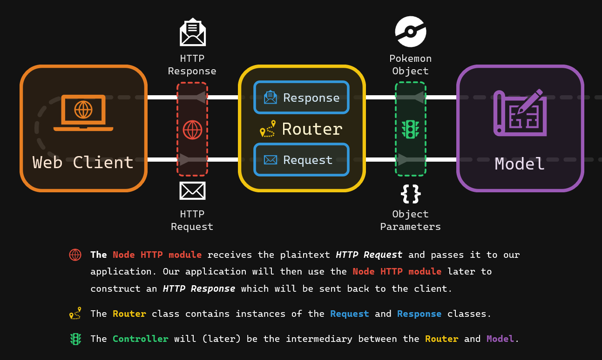

# 2 - Controllers

- 💯 **Worth**: 7%
- 📅 **Due**: March 15, 2025 @ 23:59
- 🚫 **Penalty**: Late submissions lose 10% per day to a maximum of 3 days. Nothing is accepted after 3 days and a grade of 0% will be given.

## 🎯 Objectives

- **Explain** the fundamental structure and components of HTTP requests and responses (e.g., methods, headers, status codes, body).
- **Implement** request handling logic within controller methods, extracting necessary data from the request object to process user input, allowing the user to filter and sort data through the use of query parameters.
- **Trace** the flow of a request through the web server, router, and controller, identifying how each component transforms or contributes to the response generation.
- **Expand** the router’s capabilities by defining new routes that map to appropriate HTTP methods and controller actions.
- **Assess** different HTTP status codes and determine the most appropriate scenarios for their use in controller methods, ensuring meaningful communication to the client.

## 🔨 Setup

1. [Click here](https://classroom.github.com/a/izRhndQP) to join the Git classroom.
2. Clone (do not download as a zip) the starter repository from GitHub. Make sure you use the link from Moodle to fork the proper repository.
3. Make sure Docker Desktop is open.
4. Start the development container in VS Code by using the `Dev Containers: Open Folder in Container...` command from the Command Palette (CTRL/CMD+SHIFT+P) and select the cloned directory.
5. Run the `npm install` in the terminal to install all necessary dependencies.
6. Verify that the database was set up properly by running:
   1. `psql` to connect to the database server.
   2. `\c TodoDB` to connect to the database.
   3. `\dt` to see the list of tables. There should be `todos` and `subtodos`.

> [!Note]
>
> If the database does not get set up properly when you first build your container, you can run `psql -f .devcontainer/init.sql` (making sure you’re inside the container, i.e. the bottom left of VSC should say “Dev Container”) to manually run the initialization script.

## 🔍 Context

To complete this assignment, you should be familiar with the following concepts and theories:

- **[MVC Architecture](https://pdmelo.github.io/4W6-Winter-2025/#/Notes/Week2/mvc)**: Understanding the role of the **Controller** in the MVC (Model-View-Controller) pattern.
- **[TypeScript](https://pdmelo.github.io/4W6-Winter-2025/#/Guides/typescript)**: Knowledge of basic TypeScript syntax and type system, as well as more intermediate concepts such as *partial types* and *index signatures*.
- **[HTTP](https://pdmelo.github.io/4W6-Winter-2025/#/Notes/Week4/21-http)**: Knowledge of HTTP responses, setting status codes, headers, and a JSON payload.
- **[Routing](https://pdmelo.github.io/4W6-Winter-2025/#/Notes/Week4/22-routing)**: Register route handler functions within the router to establish the association between URL patterns and actions.
- **[Testing with Jest](https://pdmelo.github.io/4W6-Winter-2025/#/Guides/testing)**: Familiarity with Jest and how to run tests for TypeScript applications.

> [!Caution]
>
> If you’re not comfortable with any of the above, **please send me a message on Teams** and I can help you! It is your responsibility to ensure you have learned all concepts we’ve seen so far so that you can do the assignment effectively.

In this assignment, you will be implementing the controller which sits in between the model (interacts with the database) and the server router (interacts with the HTTP requests). Before starting that however, you must understand how the **server** and **router** classes work. Consult the diagram below while reading the comments inside `Server.ts` and `Router.ts`.



Once you have a good grasp about how the server and router work, this is where the controller fits in:


#### Server
<details ><summary>Click to expand</summary>

-  **The Heartbeat:** The foundation of your web application. It handles incoming HTTP requests (from browsers or other clients) and orchestrates the process of generating an appropriate response.
- **Responsibilities:**
    - Listens for requests on a specific port.
    - Parses requests (URLs, headers, body)
    - Delegates request handling to the router.
    - Sends back HTTP responses to the client.</details>

#### Router
<details>
<summary>Click to expand</summary>

- **The Traffic Director:** Responsible for mapping incoming request URLs and HTTP methods (GET, POST, etc.) to specific pieces of code that will handle them (controllers).
- **Responsibilities**

    - Stores a table of routes and associated controller actions.
    - Matches incoming requests to the correct route.
    - Calls the appropriate controller method.</details>

#### Controller
<details><summary>Click to expand</summary>

-  **The Action Handler:** Where the core business logic of your application lives. It receives requests from the router and processes them. 
- **Responsibilities:**

    - Interacts with the model to fetch or update data.
    - Handles input validation and error checking.
    - Prepares data to be sent back in the response, often as JSON or rendered into HTML using a view engine (which we’ll see later).</details>

#### Model
<details>
<summary>Click to expand</summary>

- **Data Representation:** Represents the real-world entities in your application (e.g., users, products, blog posts). Often maps directly to your database structure.
- **Responsibilities**

    - Handles data persistence (interacting with the database).

    - Enforces data rules and constraints (validations, relationships).

    - Provides functions to retrieve, create, update, and delete data (often called CRUD operations</details> 
    
#### Database
<details>
<summary>Click to expand</summary>

- **The Memory:** The storehouse for your application’s data. Could be a relational database (MySQL, PostgreSQL), document database (MongoDB), or other types.

- **Responsibilities**

    - Stores data in a structured manner.
    - Provides ways to query and manipulate data (e.g., SQL for relational databases).</details> 
    
      
## 🚦 Let’s Go
Continuing from last assignment, your task now is to create the controller layer of the todo application that keeps track of a user’s task list. You will accomplish this by implementing the CRUD routes in the provided TodoController.ts class skeleton.

> [!ATTENTION] 
> ** Read the Comments**
>
>I have left detailed comments in all the classes. Please read them and then re-read them to get a solid understanding about what is expected from you. The comments are part of the assignment instructions to help you know what to do.

### Part 1 - Controller (80%)
Inside `TodoController.ts`, you must implement the following:

- **Route Registration:** Using the route that is already in this method as a reference, register each new route one by one as you work.
- **Controller Methods: ** Each method accepts a `Request` and `Response` object. You’ll have to use these objects to get the data from the request and send the appropriate response.
- **Input Validation:** Use the `isValidTodoProps` function (and potentially add further validation logic) to ensure data integrity before interacting with the database.
- **Error Handling:** Implement `try-catch` logic to handle database errors or situations like not finding a Todo based on its ID.
- **Construct Responses:** Send appropriate HTTP status codes (200, 201, 400, 404, 500) and construct informative JSON responses containing Todo data or error messages.

### Part 2 - Filtering & Sorting (10%)
In this part, you’ll extend the capabilities of the `TodoController` to allow users to optionally filter (by status) and sort the list of Todos retrieved. The `Todo` model’s `readAll` method should dynamically add filtering and sorting to your database queries.

1.  **Accessing Parameters:** Your `TodoController` will receive query parameters from the incoming request (e.g., `/todos?completed=true&sortBy=title`). You’ll need to extract these parameters using the provided function in the `Request.ts` class.

2. **Calling readAll:** Pass the extracted parameters to the Todo.readAll() function, for example:

```ts
const filteredAndSortedTodos = await Todo.readAll(sql, filters, sortBy);
```

3. **Build Filters with ‘postgres’:** Inside the `readAll` function, use the `postgres` library (`Sql<any>`) to construct a WHERE clause based on the provided `filters` object.

    - For now, the only filter you need to implement is the `status` filter (e.g., `WHERE status = ${filters.status}`).
    - Since not all requests will have a filter query parameter, you’ll have to build your queries using the syntax shown in the [postgres.js documentation](https://github.com/porsager/postgres?tab=readme-ov-file#building-queries).
4. **Handle Sorting:**
    - Any column is fair game for sorting. Assume only one column per request can be used to sort. Meaning, you don’t have to worry about sorting by `title` AND `due_at` in one request.
    - Check if the `sortBy` parameter is provided, and if so, use `postgres` to append an `ORDER BY ${sortBy}` clause to the query.
    - Note that [dynamic order](https://github.com/porsager/postgres/issues/744) by doesn’t work how you’d think, so you’ll have to click that link and see how to do it.
> [!NOTE] 
>
>Reading the open source issues and docs is something you should get used to doing. Part of being a professional software developer is being comfortable hunting the docs and searching for answers!


### Part 3 - SubTodos (10%)

For the last extra challenge, try your hand at SubTodos again! Recall that a SubTodo is a stripped down Todo that is associated with one parent Todo.

- **SubTodo Logic:** Copy over your `SubTodo` model from last assignment if you completed it. If you didn’t, write the database interaction logic to create, read, update, and delete subtodos. Ensure a relationship between SubTodos and their parent Todos. The database table has already been provided for you.
- **Analyze the Pattern:** Examine the provided `Router` and `TodoController` code to grasp how requests are mapped to controller actions, and how the controller interacts with the database.
- **Replicate:** Create a `SubTodoController` and mirror the patterns used for Todos.
- **Implement Routing:**  Add routes for SubTodo-related operations, mapping them to your new `SubTodoController` methods.

## 💡 Tests & Tips
> [!WARNING ]
>
> **Tests are a Guide**
>
>Passing all the tests is **not an indicator for obtaining 100%.** Granted, when you do pass all the tests it’s definitely a good sign. However, the tests are provided as an aide for you to guide your development.

- The tests will give you an idea about what I’ll be looking for, **but I haven’t written tests for every single case.** Be judicious when determining which response status code to use and how you’ll gracefully let the user know what went wrong without the app blowing up. For example:

  - If the request gives an invalid path (ex. `GET /todos/abc`) then the response should send back a 400 Bad Request.
  - If the path is valid, but the resource does not exist (ex. `GET /todos/999`) then the response should send back a 404 Not Found.
- Ensure the database is being affected how you think it should be by pausing on a breakpoint in your code and running a select statement on the database using psql. **I advise having two terminals open, one with** `psql`, **and the other with** `npm run test`.
- You won’t need to run the server in one terminal and run the client in another like for the past exercises. This is because the tests take care of starting and stopping the server as needed. **I advise running the tests** [one-by-one](https://pdmelo.github.io/4W6-Winter-2025/#/Guides/testing) in a [debug terminal](https://pdmelo.github.io/4W6-Winter-2025/#/Guides/debugging).
- Does the test time out before you’re done debugging? Increase the timeout time inside `jest.config.js`.
- Tests running painfully slow? Don’t use them to run your code each time. You can manually test your code by creating an` app.ts` file at the root of your project:

app.ts
```ts
import postgres from "postgres";
import Server from "./src/Server";
import { HttpResponse, makeHttpRequest } from "./tests/client";


const sql = postgres({
  database: "TodoDB",
});

const server = new Server({
  host: "localhost",
  port: 3000,
  sql,
});

const main = async () => {
  await server.start();

  const { statusCode, body }: HttpResponse = await makeHttpRequest(
    "GET",
    "/todos"
  );

  console.log(statusCode, body);

  await sql.end();
  await server.stop();
};

main();
```
You can run this file by running `tsx app.ts`:

```Terminal window
$ tsx app.ts
Server running at http://localhost:3000/.
>>> GET /todos
<<< 200 Todo list retrieved []
 200 { message: 'Todo list retrieved', payload: [] }
Server stopped.
```
Once you’re happy with your manual test, run the equivalent automated test to see if it passes!


## 📥 Submission
To submit your assignment, follow these steps:

1. Commit your changes to the local repository, for example:

```Terminal window
git add .
git commit -m "Completed Todo controller implementation."
```
2. Push your commits to the remote repository:

```Terminal window
git push
```
3. Submit your assignment on Gradescope.
        1. Go to Gradescope, log in, and click the link for this assignment.
            2. Select the correct repository and branch from the dropdown menus. 
            3. Click *Upload*.