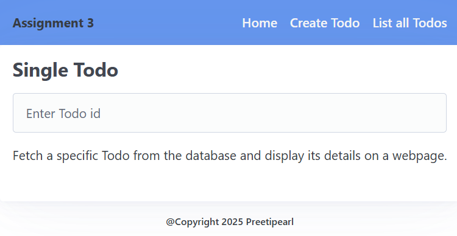
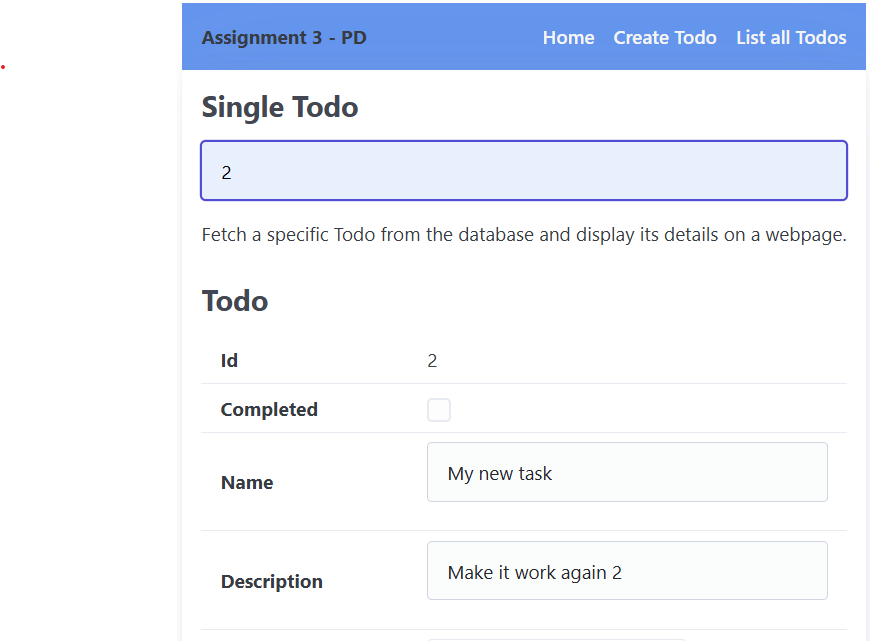
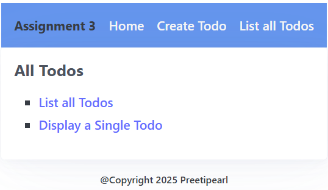
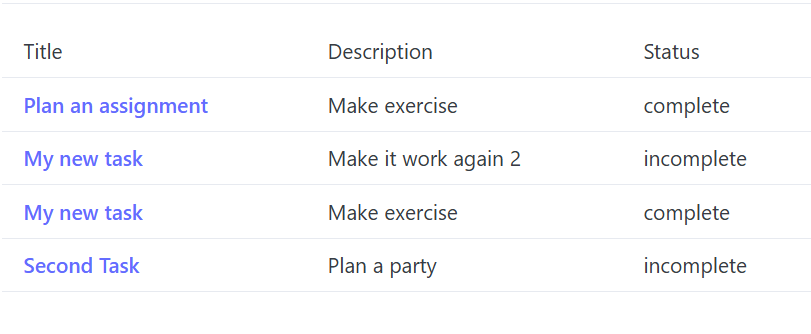

#  3-Views

- 💯 **Worth**: 7%
- 📅 **Due**: April 13, 2025 @ 23:59
- 🚫 **Penalty**: Late submissions lose 10% per day to a maximum of 3 days. Nothing is accepted after 3 days and a grade of 0% will be given.

## 🎯 Objectives

- **Create** React components to display and manage the view layer of the application, ensuring they render dynamic content based on the data received from the backend (e.g., showing a single `Todo`, a list of `Todos`, or handling `form` submissions).
- **Implement** **State Management with React Hooks**: Use React hooks, like `useState` and `useEffect`, to manage component states. This includes tracking user inputs, validating forms, and managing the loading state during data fetching.
- **Design** the user interface in React, using components to display `Todo` details and lists. Ensure the layout is responsive and provides a user-friendly experience.
- **Handling HTTP Requests**: Use the `fetch` API to send HTTP requests from the React app to the backend. Update the UI based on the responses, such as creating, editing, or deleting Todos.
- **Dynamic Routing with React Router**: Implement dynamic routing using React Router to allow users to navigate between different views, such as viewing a single Todo, a list of Todos, or the form to create or edit a `Todo`.
- **Manage Form Data and User Input**: Implement controlled components to manage form data. Ensure the data is passed correctly to the backend, and that state updates are reflected in the UI.

## 🔨 Setup

1. [Click here](https://classroom.github.com/a/3XpAOuHA) to join the Git classroom.
2. Clone (do not download as a zip) the starter repository from GitHub. Make sure you use the link to fork the proper repository.
3. Make sure Docker Desktop is open.
4. Start the development container in VS Code by using the `Dev Containers: Open Folder in Container...` command from the Command Palette (CTRL/CMD+SHIFT+P) and select the cloned directory.
5. Open a terminal, cd to `server` start the server using `npm run server`
6. Open another terminal and Verify that the database was set up properly by running:
   1. `psql` to connect to the database server.
   2. `\c TodoDB` to connect to the database.
   3. `\dt` to see the list of tables. There should be `todos` and `subtodos`.
   4. Start by adding atleast one item in the table.
7. Open another terminal. cd to `client` start the react using `npm run client` 

## 🔍 Context

To complete this assignment, you should be familiar with the following concepts and theories:


- **[MVC Architecture](/Notes/Week2/mvc)**: Understanding the role of the **View** in the MVC (Model-View-Controller) pattern.
- **[TypeScript](/Guides/typescript)**: Knowledge of basic TypeScript syntax and type system, as well as more intermediate concepts such as _partial types_, _index signatures_, _generics_, and _type guards_.
- **[React](/Notes/Week8/React)**: How to use thereact to render dynamic content in HTML.


>[!CAUTION]
>If you’re not comfortable with any of the above, please send me a message on Teams and I can help you! It is your responsibility to ensure you have learned all concepts we’ve seen so far so that you can do the assignment effectively.

In this assignment, you will be implementing the view layer of your application. The view layer is responsible for rendering the HTML that the user sees in their browser. This is where you’ll create the components for creating and editing `Todos`, and the components for displaying a single `Todo` and a list of `Todos`.

## 🚦 Let's Go

>[!note][Read the Comments]
>I have left detailed comments in all the components. Please read them and then re-read them to get a solid understanding about what is expected from you. The comments are part of the assignment instructions to help you know what to do. It's up to you to (most importantly for this assignment) understand the relationship between the controller, response, and view .

### Part 1: Create the basic layout of pages.

**Goal** Set Up the pages with React Router.

Define the application layout. Configure Routes for the components.

Example: (You may need to create components and adjust your route as per your design)

- `/` → Renders `<Home />`.
- `/create` → Renders `<CreateTodo />`.
- `/list-todos` → Displays `<DisplayTodos />`.

> [!TIP]
>
> Read the comments in the `DisplayTodos` component. Create additional components accordingly.


### Part 2: Displaying a Single Todo (10%)

**Goal**: Fetch a specific Todo from the database and display its details on a webpage.




>[!Note]
>CSS
>You can style your views as you see fit, but it’s not required. The focus is on the functionality of the views, not the design. If you’d like to style your views, you can edit `styles/index.css`.

1. **Database Preparation:**
   - Ensure you have at least one `Todo` item in your database.
   - You can add this manually using `psql` from the terminal and running an `INSERT` statement.
   - Take note of its unique ID.
   
2. **Controller Logic:**
   - Currently, the existing `TodoController` methods only send JSON responses.

3. **Create the Component:**
   - Create a component `FetchOne.jsx`  that receives the `todoId` from the user. This component will then fetch the data from the backend servers. 
   
   - Comments are provided in the code to help you guide through.
   
   - Implement the `fetchTodo` function to fetch a Todo using the API.
   
     ```jsx
     /**
      * Configuration object for an HTTP GET request.
      *
      * @property {string} method - The HTTP method to use (GET).
      * @property {string} mode - The CORS mode, set to "cors" to allow cross-origin requests.
      */
     const requestOptions = {
     			method: "GET",
     			mode: "cors",
     		};
     
     const response = await fetch(`http://localhost:3000/todos/${todoId}`,requestOptions);
     
     if (response.ok) {
     	const data = await response.json();
     	setTodoItem(data.payload.todo);
     }
     ```
   
     
   
   - Store the fetched data in state using `useState`.
   
   - Render the `ShowView` component when a Todo is found.
   
   - Display the Todo using the `ShowView` component.
   
     - In the  `ShowView.jsx`, display the `title`, `description`, and `status` of the Todo object passed from `FetchOne.jsx`.
     - Structure the HTML to nicely present the Todo information. The organization is totally up to you.
   
   - **Implement Data using `useEffect`:**
   
     - Use the `useEffect` hook to fetch the Todo when the `todoId` changes.
     - Ensure error handling in case the API request fails.
   
   - **Actions handlers:**
   
     - Implement the `onSaveHandler` function for updating the Todo.
     - Implement the `onDeleteHandler` function to delete the Todo.
     - Implement the `onCompleteHandler` function to mark the Todo as complete.
   
   - **API Endpoints:**
   
     - Fetch: `GET http://localhost:3000/todos/{todoId}`
     - Update: `PUT http://localhost:3000/todos/{todoId}`
     - Delete: `DELETE http://localhost:3000/todos/{todoId}`
     - Mark Complete: `PUT http://localhost:3000/todos/{todoId}/complete`
   
   - **User Interface:**
   
     - **Create the** `**ShowView**` **Component**
   
       - Display the Todo details.
       - Provide buttons for updating, deleting, and marking the Todo as complete.
       - Call the respective functions when buttons are clicked.
   
       
   
4. **Testing:**

Visit a URL like http://localhost:3000/todos/1 (replace ‘1’ with the actual ID of your Todo).
You should see the details of your Todo in the json file
Visit the client URL http://localhost:5173/  to display details of the single todo.

Example:



### Part 2: Displaying a List of Todos (15%)
**Goal:** Fetch all of your Todos from the database and display them in a neatly formatted list on a webpage.
           

1. **Database Preparation:**
   - In addition to the single Todo you created in part 1, add a few more Todos to your database. This will allow you to see how your list view handles multiple items.
2. **Controller Logic:**
   - Just like in part 1, the controller method is already handling `GET /todos` and sending a JSON response back.
   - Pass the array of Todos 
3. **Create the Component:**
   - Use this component `DisplayAll.jsx`to fetch the data and display it. Since this is the list view, show less detail per Todo item. At the very minimum, the `title` `Description` and `Status` should be displayed.
   -  Comments are provided in the code to help you guide through.
   
   - Implement the `getAll` function to fetch all todo using the API.
   
     ```jsx
     /**
      * Configuration object for an HTTP GET request.
      *
      * @property {string} method - The HTTP method to use (GET).
      * @property {string} mode - The CORS mode, set to "cors" to allow cross-origin requests.
      */
     const requestOptions = {
     			method: "GET",
     			mode: "cors",
     		};
     
     const response = await fetch(`http://localhost:3000/todos/todos`,requestOptions);
     
     if (response.ok) {
     	const data = await response.json();
     	setTodoItem(data.payload.todo);
     }
     ```
   
4. **Testing:**
   - Visit `http://localhost:3000/todos`. You should see a list of your existing Todos!
   - Visit the client URL http://localhost:5173/ 
     - Navigate to the page like the screen shot above.
     - Clicking on the List all Todos, should display all the todos.

Example:


**Extra Feature: (Bonus points)**

- Each listed todo, should be clickable to display the details of the  todo.

### Part 3: Creating a New Todo (25%)
**Goal:** Allow users to create new Todos by filling out a form and submitting their input to the server.


<div style="position:relative; width:100%; height:0px; padding-bottom:62.500%;">
	<iframe allow="fullscreen;autoplay" allowfullscreen height="100%" src="/Assignments/images/Create-todo.mp4" width="100%" style="border:none; width:100%; height:100%; position:absolute; left:0px; top:0px; overflow:hidden; border-radius: 5px; ">
	</iframe>
</div>


1. **Create the Component:**

   - Create the Template `CreateTodo.jsx`:

   - Inside the following input fields in the component create an HTML.:
   	- Title 
   	- Description 
   	
  - This form should make a `POST` request to `/todos` when submitted.


   - Display a pop up confirming the creation.


   - After a successful creation, you need to redirect the user to the newly created Todo’s ShowView, ex. /todos/newId. ( Look at the notes here for [redirects](https://pdmelo.github.io/4W6-Winter-2025/#/Notes/Week9/react-router)

   - If the form data is invalid (missing title or description), then render the  **CreateTodo** again with an alert message pop up to let the user know what went wrong.
-  Comments are provided in the code to help you guide through.
   
   - Implement the `submitHandler` function to fetch all todo using the API.
   
     ```jsx
     /**
      * Configuration object for an HTTP POST request.
      *
      * @property {string} method - The HTTP method to use (POST).
      * @property {string} mode - The CORS mode, set to "cors" to allow cross-origin requests.
      */
     const requestOptions = {
     			method: "POST",
     			mode: "cors",
     			headers: { "Content-Type": "application/json" },
     			body: JSON.stringify({
     				title: //the title from the user
     				description: //the description from the user,
     			}),
     		};
     
     const response = await fetch(`http://localhost:3000/todos/todos`,requestOptions);
     
     if (response.ok) {
      alert(`Todo title ${inputField.todo_title} Created!`);
     }
     ```

2. **Controller Logic:**
   - The controller method to handle the POST /todos route already exist
   - Creates a new Todo in the database using the provided data.
   - Sends a JSON response back to the client.

3. **Testing:**

- Visit http://localhost:3000/todos/ You should see the new todo in the database
- Visit the client URL http://localhost:5173/ 
	- List all the the todos on your app to view the new todo you just added.

-----

### Part 4: Editing Todos (25%)

**Goal**: Provide a way for users to modify existing Todos.
<div style="position:relative; width:100%; height:0px; padding-bottom:62.500%;">
	<iframe allow="fullscreen;autoplay" allowfullscreen height="100%" src="/Assignments/images/edit-todo.mp4" width="100%" style="border:none; width:100%; height:100%; position:absolute; left:0px; top:0px; overflow:hidden; border-radius: 5px; ">
	</iframe>
</div>


1. **Modify the Template:**

There are multiple ways to achieve this. I suggest use the `ShowView.jsx` component, to have the `edit`button.
- This  should be similar to your `CreateTodo.jsx`, but pre-populated with the existing Todo’s information so that the user can easily make changes.
- After successfully updating the Todo in the database, you need to redirect the user to the updated Todo’s ShowView, ex. `/todos/:id`.
- Review the Action handlers in the `FindOne.jsx` and the comments in the `ShowView` components to guide you through the implementation.

2. Controller Logic:

- The controller method to handle the PUT /todos route already
>[!NOTE]
>There’s no form validation here because if title or description` are missing in the request, they just won’t be updated. The user can’t delete a Todo’s title or description, so there’s no need to validate that they’re present.

3. **Testing:**
   - Visit the client URL http://localhost:5173/  Display a single Todo
   - Click on `Edit` button to update the todo.
   - Click on `Save` button  save the data. 
   - Visit http://localhost:3000/todos/ You should see the updated todo in the database or even in the `Show Single Todo` of your application.

**Extra Feature: (Bonus points)**

- Click on `Cancel`button to cancel the edit


### Part 5: Mark Complete (5%)

**Goal**: Allow users to mark a Todo as complete.

Example:
<div style="position:relative; width:100%; height:0px; padding-bottom:62.500%;">
	<iframe allow="fullscreen;autoplay" allowfullscreen height="100%" src="/Assignments/images/mark-complete.mp4" width="100%" style="border:none; width:100%; height:100%; position:absolute; left:0px; top:0px; overflow:hidden; border-radius: 5px; ">
	</iframe>
</div>


1. **Modify the Template:**
   - You don’t need to create a new view for this part. Instead, add a button to the `ShowView` that, when clicked will trigger the `markAsComplete` callback in the `FindOne`, which will then send a `PUT`  request to `/todos/:id/complete`. Comments in the code.
   - How will you show that a Todo was completed? Perhaps showing it with a strikethrough? A different colour? Using an icon/image ✅? It’s up to you2.
   
2. **Controller Logic:**
   - After successfully updating the Todo in the database in the `PUT /todos/:id/complete` route handler, you need to redirect the user to the updated Todo’s ShowView, ex. `/todos/:id`.

3. **Testing:**

   - Visit the client URL http://localhost:5173/  Display a single Todo .
   - Click on `Mark Complete` button  mark the task complete. (OR whichever mechanism you provided.)
   - Visit http://localhost:3000/todos/ You should see the updated todo in the database or even in the `Show Single Todo` of your application.
   - - Visit the client URL http://localhost:5173/  Display a single Todo or display All to view the update.


### Part 6: Deleting Todos (5%)
**Goal:** Allow users to delete a Todo.

Example:
<div style="position:relative; width:100%; height:0px; padding-bottom:62.500%;">
	<iframe allow="fullscreen;" allowfullscreen height="100%" src="/Assignments/images/delete-todo.mp4" width="100%" style="border:none; width:100%; height:100%; position:absolute; left:0px; top:0px; overflow:hidden; border-radius: 5px; ">
	</iframe>
</div>


- 
  By this point you should know the drill. Like in the previous part, add the `delete` button to the `ShowView`. This way, the user can delete a Todo right from the Todo’s page. Onclick will trigger the `onDelete` callback in the `FindOne` component.

- once Deleted redirect the use to the List of All Todos


### Part 7: Extra Feature (15%)
Choose ONE of the following to implement. You can choose to implement more than one if you’d like, but you will only receive marks for your best one.

#### Option 1: SubTodos
- Add a form in the `ShowView` to add a SubTodo to the Todo.

- List the SubTodos in the `ShowView` below the Todo’s details.
- Add a mechanism mark each SubTodo to mark it as complete.

#### Option 2: Date Fields and Cancel Button. 
1. Add a <input type="date"> to the `CreateTodo` and `ShowView` to allow users to set a due date for their Todos.
   In the ShowView, display the due date if it’s set, along with the created date and completed date if the Todo was completed.

On the `ShowView` component or the  Edit page, 

2. Click on `Cancel`button to cancel the edit, and just show uneditable View of the the Single Todo.
3. In the list all Todos, Each listed item should be clickable to render the details of the todo, i.e the display  Single Todo page., 
>[!TIP] 
>You will need to define a route for `todo/:id` in your route on `App.jsx`


#### Option 3: Filtering & Sorting
Update the `DisplayAll` component to  allows users to:

- Filter the list of Todos by status. They should be able to filter by “complete” or “incomplete” status.
- Sort the list of Todos by title, created date, or due date. They can also pick the order (ascending or descending).
- This can be done either by :
  - **OPTION 1** : sending a `GET` method with the filter and sort options in the API  (recommend this for our assignment since we have already implement this endpoint in our controller)
  - **OPTION 2**: Do the filter and sorting in the client side.  Since we have the list of all todos. Find a React library to sort/ filter data to display it.


<div style="position:relative; width:100%; height:0px; padding-bottom:62.500%;">
	<iframe allow="fullscreen;" allowfullscreen height="100%" src="/Assignments/images/filter-sort.mp4" width="100%" style="border:none; width:100%; height:100%; position:absolute; left:0px; top:0px; overflow:hidden; border-radius: 5px; ">
	</iframe>
</div>

>[!TIP]
>If you were to include other React libraries
>cd to client , confirming package.json is in the same folder then 
>`run npm install module_name`
>It should automatocally add the module in the package.json (this will ensure smooth testing on my side.)


### 📥 Submission

To submit your assignment, follow these steps:

1. Commit your changes to the local repository, for example:

```bash
git add .
git commit -m "Completed View implementation."
```
2. Push your commits to the remote repository:

```bash
git push
```
3. Submit your assignment on Gradescope.

	1. Go to gradescope.ca (not .com!), log in, and click the link for this assignment.
	2. Select the correct repository and branch from the dropdown menus.
	3. Click Upload.