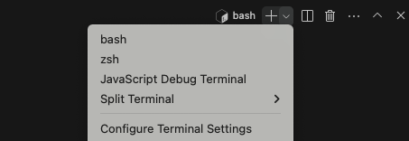
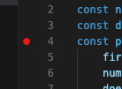
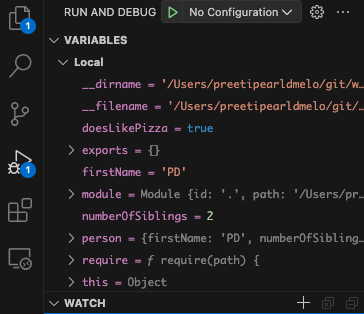
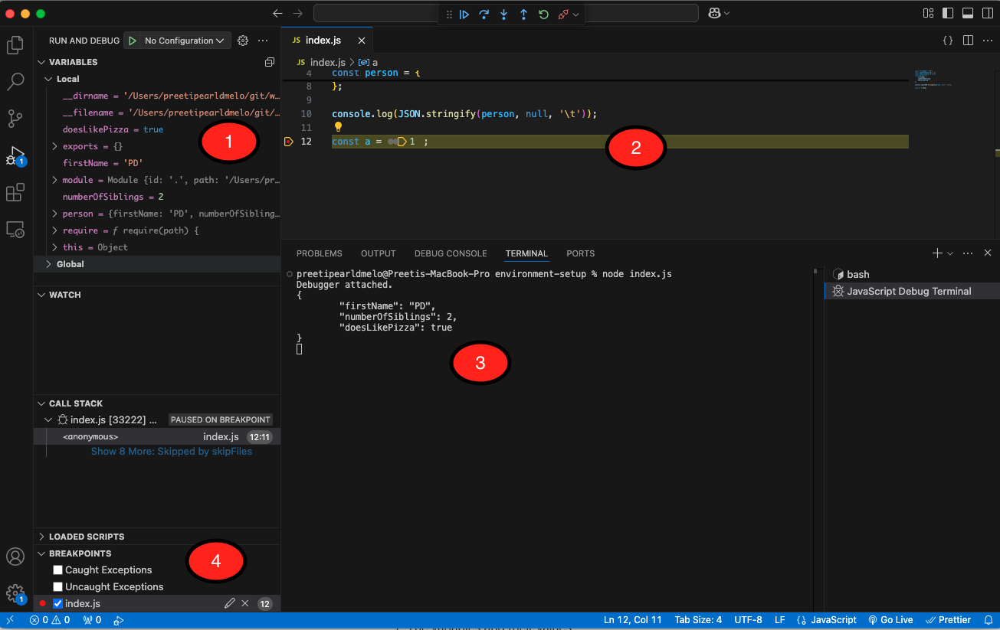

# Debugging

1. Inside the terminal panel of VSC, click on the dropdown menu and select  `JavaScript Debug Terminal`.

   

   This will create a new terminal instance. To go back to the first terminal, you can select it from the same dropdown menu.

2. In this new debugging terminal, run the command that to run your code (ex. `tsx app.ts`, `npm test`, depending on what you’re working on) and you should see `Debugger attached.` in the terminal, followed by the execution of the program, followed by `Waiting for the debugger to disconnect...`.

3. Set a breakpoint in `app.ts` by clicking to the left of any line number.

4. Run your code and the program should pause its execution on the line which you set the breakpoint.

5. Click on the debugger tab on the left navigation and you should see a list of all the current variables and their values. 
             

 1.  The variables and their values;
 2. The yellow bar indicating the program has paused execution;
 3. The output in the terminal;