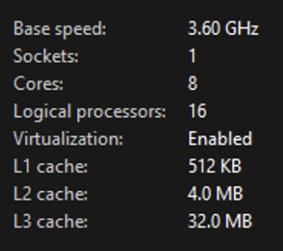
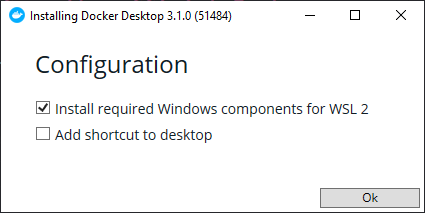

# Environment Setup

## 🎯 Objectives

**Install** the Windows Subsystem for Linux (Windows users only). - **Install** Docker.

- **Install** Visual Studio Code.

If you’re using 🍎 MacOS or a 🐧 Linux distribution, you can skip down to the[ 🐳 Docker](#🐳-docker) section: 

## 🪟 Windows Users

>[!NOTE]**WSL**
>
>A cool new feature Microsoft has been working on is called the _Windows Subsystem for Linux_. This allows developers to run Linux environments on their Windows machine so you can leverage the strengths of both operating systems.

1. Make sure virtualization is enabled by going to the **Task Manager** under the **Performance** tab:

2. If virtualization is disabled, you’ll have to go into your BIOS and enable virtualization. This will look different depending on what kind of motherboard you have, usually Intel or AMD.

   - For AMD, enable a feature in the BIOS called **SVM**.
   - For Intel, enable a feature in the BIOS called **VT-x**.
   - If none of these work, you’ll have to look up how to turn on virtualization for your specific model of motherboard.
3. Click on the Windows button, type “features”, and select **Turn Windows features on or off**
     - Enable **Virtual Machine Platform**.
     - Enable **Windows Subsystem for Linux**.
     - Click OK and restart your computer.

4. Click on the Windows button, type “Microsoft Store”, and open the Microsoft Store app.

5. Search for “WSL” and install **Windows Subsystem for Linux**.

## 🐳 Docker

> [!NOTE]
>
> What even is?
>
> If you’re not sure what Docker is, read up on it [here](../Notes/Week2/docker) first.

1. The *getting started guide* on Docker has detailed instructions for setting up Docker on [Mac](https://docs.docker.com/docker-for-mac/install), [Linux](https://docs.docker.com/install/linux/docker-ce/ubuntu) and [Windows](https://docs.docker.com/docker-for-windows/install).

2. 🏠 Windows users: If the installer prompts you, make sure WSL2 option is checked:

   

## 💻VS Code

1. Download and install the appropriate version of [VS Code](https://code.visualstudio.com/Download) for your OS.

2. When you open VS Code for the first time, it might prompt you to install the `Dev Container` extension. If it does, click install.

   - If you already had VS Code installed, you’ll have to go to the _extensions_ tab in the left navigation bar (icon of the 4 squares) and search for `Dev Container`. Click install.

Congratulations - you’re now set up to run NodeJS applications! 🥳