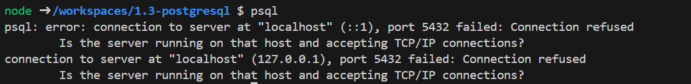

# Troubleshooting

## psql connection error 'error: connection to server at "localhost" (::1), port 5432 failed'

1. Restart docker.
2. If that doesn't fix it
   1. Close connection to the remote container
   2. delete the container and its associated volume in the docker
   3. Reopen the folder in the container..

## Dev Container configuration ‘.devcontainer/devcontainer.json’ file already exists

1. Go to your VS Code extensions (icon of the four squares on the left sidebar).
2. Click on “Dev Containers”.
3. Click on “Switch to Pre-Release”.
4. Click on “Reload”.