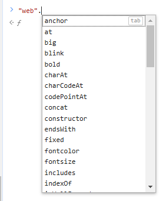
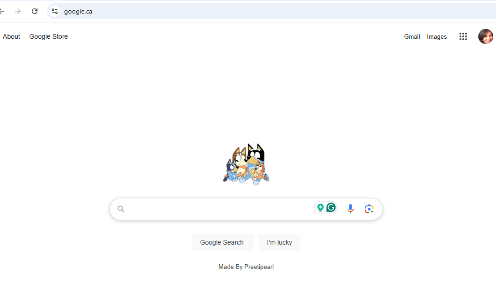

# 0.1 - NodeJS Basics

## 🎯 Objectives

- **Explain** what NodeJS is and why its useful.

- **Compare** and **contrast** client-side JavaScript using a browser versus server-side JavaScript using Node.

- **Explain** the difference between blocking (synchronous) code and non-blocking (asynchronous) code.

- **Write** both blocking and non-blocking code.

## 🔨 Setup

1. Create a new folder somewhere on your computer, I suggest the home `~` folder: `mkdir ~/web-ii && mkdir ~/web-ii/exercises`.

2. Open Visual Studio Code, go to `File -> Open Folder`, and open `~/web-ii/exercises`.

3. Open a terminal by going to `View -> Terminal` (` CTRL + `` or  `CMD + ``).

   > [!NOTE]
   >
   > **Backtick**
   >
   > \" ` " is the _backtick_ symbol located on the top left of the keyboard, usually under the escape key.

4. Create a new folder `mkdir ~/web-ii/exercises/0.1-node-basics && cd 0.1-node-basics`, and it should appear in the file explorer in VS Code.


## 🔍 Context

### What is NodeJS?

- NodeJS is **not** a programming language! It’s a **runtime environment** that allows you to execute JavaScript outside of the browser..
- Before Node, the only place JS could run was in a web browser runtime environment. JS was used only to add interaction to web pages like customizing what happens when a user clicks on a button or dynamically manipulating the DOM.
- With Node, we can create applications that run directly on our machines rather than in a web browser. Node is an alternative runtime that can run JS such that we can do things like access the file system of our computer or talk to databases. This means that we can now use JS to program both the _front-end_ (client) and _back-end_ (server) of our web applications.

### Why use NodeJS?

- Node jobs are highly in demand in the web sector. [Click here to see for yourself!](https://ca.indeed.com/jobs?q=node.js&l=Montréal%2C+QC)

- Since Node is just JS at the end of the day, this means that you can use one language for the whole stack (front and back end) which reduces the need to know/maintain multiple languages/technologies.

- Node. JS uses  non-blocking  I/O model (i.e. asynchronous) . JS was originally non-blocking when it was written for the browser. If everything in JS was blocking, then when a user clicked a button, for example, they’d have to wait for it to finish before they could continue interacting with the webpage. 

  - Non-blocking code enables us to write more performant applications.

    


## 🚦 Let’s Go

First we’ll play around with JavaScript in the browser to establish a baseline. This should be very familiar to you already coming from Web Programming I from last semester. After that, we’ll see how JS is different when running it with Node instead of a browser.

### Client-Side JavaScript (Browser)

1.  Open your web browser of choice. Preferably Chrome or Firefox.

2.  Open the developer tools by hitting `CTRL + SHIFT + I` and make sure you’re on the _console_ tab.

3.  Type a mathematical expression like `1 + 1` into the console and hit enter. You should see `2` as the output.

4.  Type any string and then `.` like you want to call a function. You should see a list appear of all the functions you can call on a string. There are lots!

    

5.  Choose the `.toUpperCase()` method and execute the statement. You should see the string in all caps as the output.
6.  Now let's try something a bit more fun! Go to [Google's homepage](https://google.com), right-click the logo, and click on _inspect element_. In the DOM that appears in the dev tools, find the `id` attribute that the `` tag is using to display the Google logo. Take note of that `id` value.
7.  In another tab, look up any (appropriate) image you think would be funny to display on the Google page and copy the URL to the image. Make sure the URL ends in a valid image file extension like `.jpg`, `.png`, etc.
8.  Back to the Google tab, in the dev tools console, type:

    > document.getElementById("id from step 6").srcset = ""; <br/>
    > document.getElementById("id from step 6").src = "image URL from step 7";

    And you should see your image replace the Google logo!

9.  Right-click on the text under the Google search button that says "Google offered in: Français" and note the ID of that element.
10. In the dev tools console, change the text of the element to read `Made by <Your Name>` using JavaScript. It will be similar to how you changed the `.src` attribute on the `` element from step 8, but you'll have to use the `.innerHTML` property this time to change the text.
11. Take a screenshot of the page with your new image and text and save it inside the folder for this exercise. It should resemble something like this:



### Server-Side JavaScript (Node)

1. Switch over to the terminal in your Visual Studio Code window, type `node` and hit enter.

   - If you get an error saying “command not found”, then make sure you install the LTS version of [Node.js](https://nodejs.org/en).

2. You should see that your terminal’s prompt has changed to `>`. This means that you’re inside of a Node *REPL* which stands for *read evaluate print loop*. We can use this REPL environment just like we used the browser dev tools console in the previous section of this exercise.

3. As before, type a mathematical expression like `1 + 1` into the console and hit enter. You should see `2` as the output just like when you did this in the browser.

4. As before, type any string and then execute the `.toUpperCase()` method. You should see the string in all caps as the output.

   > 🤔 Hopefully by now you’re thinking, *“Well, if everything is the same here (in the terminal) as it is in the browser, then what’s the big deal?“*. Great question!

5. The next thing we tried in the browser was accessing the `document` object. Let’s try doing that now. What happens if you type `document` into the REPL Node environment?

  ```bash
   > document
   Uncaught ReferenceError: document is not defined
  ```
> **Note**
>
> Why doesn’t `document` work here? Turns out, `document` is not part of JavaScript. It’s actually a part of the web browser. The browser *gives JS access to the DOM* by passing it a `document` object it can use. Since there’s no browser when using Node, that means there is no `document` object!


6. Now type `process` into the REPL and hit enter. What we’re seeing here is several methods and properties that the Node runtime is giving to JS. With this `process` object, we can do many things that we could not do in the browser. To prove it, try typing `process` in the browser dev tools console. You’ll see it will come up as `undefined`.
7. One of the methods we can call right now on the `process` object is called `exit, Type .exit`. Do this and you’ll see that we’re now back to the regular bash terminal.


### Blocking vs. Non-Blocking Code

*Blocking* code means that you have to wait for the first operation to finish before the second operation can start. With Node, it is very easy to write code that is *non-blocking*. This means that you can perform several operations at a time without having to wait for one to finish before executing another.

1. Create two new files called `sync.js` and `async.js` inside of the `~/web-ii/exercises/0.1-node-basics` folder you created in the `🔨 Setup` section of this exercise.

2. Inside of `sync.js` write a function called `getUserSync(id)`. This function will wait 2 seconds and return an object.

   - This function will take an integer as input.
   - In the body of the function, declare a variable called `timeToStop` and set its value to `Date.now() + 2000`. This value represents a time that is 2 seconds in the future.
   - Write a `while` loop that has `Date.now() < timeToStop` as the condition. Leave the body of the loop empty `{}`. As you can probably guess, this loop will act as a delay mechanism.
   - At the end of the function, return an object that has one property. This property should have a name of `userId` and a value of `id`.

3. After the `getUserSync` function is complete, call it and pass in `1` as the `id`. Print the result with `console.log()`.

4. Call `getUserSync` again and pass in `2`. Print the result.

5. Declare a variable called `sum` and assign it the expression `1 + 1`, then print `sum`.

6. Run the program by executing `node sync.js` in the terminal. Make sure you’re in the right directory! What you should see is:

   1. The program waiting 2 seconds then printing `{ userId: 1 }`
   2. Waiting another 2 seconds then printing `{ userId: 2 }`
   3. Printing `2`

7. Inside of `async.js`, write a function called `getUserAsync(id, callback)`. This function will asynchronously invoke the callback function we pass into it.

   - This function will take an integer and a callback function as parameters. If you need a refresher on callback functions, [click here](https://www.youtube.com/watch?v=pTbSfCT42_M).

   - In the body of this function, call the  `setTimeout()` method and pass into it 2 parameters:

     1. A callback function that invokes the callback we originally passed into `getUserAsync()`. When invoking the callback, pass in the `id` as a parameter like this: `callback(id)`;
     2. The integer `2000` which represents 2 seconds.

   The purpose of `setTimeout` is to execute code after a specified period of time. What is “special” about `setTimeout` is that it is *asynchronous*. This means that your program will continue to execute while `setTimeout` waits for time to pass on its own.

8. Call `getUserAsync` and pass in `1` for the first parameter. The second parameter will be the callback function that we want `getUserAsync` to invoke. You can either write this callback function externally and pass it in by name:

   ```js
   const myCallback = () => {  /* Function body goes here. */};
   getUserAsync(1, myCallback);
   ```

   or you can pass it anonymously in the parameter list:

   ```js
   getUserAsync(1, () => {
   
     /* Function body goes here. */
   
   });
   ```

   - This callback function should take one parameter: `id`.
   - The body of the callback function should call `console.log`, which should print an object. This object should have one property whose key is `userId` and value is `id`.

9. Repeat step 8, but pass in `2` as the first parameter.

10. Declare a variable called `sum` and assign it the expression `1 + 1`, then print `sum`.

11. Run the program by executing `node async.js` in the terminal. Make sure you’re in the right directory! What you should see is:

    1. The program will print `2` right away
    2. It will wait 2 seconds and then print `{ userId: 1 }` and `{ userId: 2 }` simultaneously.

12. Take a screenshot of the terminal containing the output from running both scripts.

    


Hopefully you see the difference between *blocking/synchronous* code and *non-blocking/asynchronous* code. The blocking example had to wait for each step of the program to finish before executing the next line. The non-blocking example was able to start executing 2 calls of a function while printing the result of `1 + 1` at the same time! 

## 📥 Submission

Submit the two screenshots (or one screenshot if you can manage to stitch them together) you took while doing this exercise in the Moodle drop box called *Exercise 0.1 - Node Basics*.

------

Hopefully you now understand the distinction between *JS in the browser* and *JS in Node* a little bit better. The core of the JavaScript language stays the same between the two. What changes is the objects that the runtime environment gives to JavaScript to work with.
