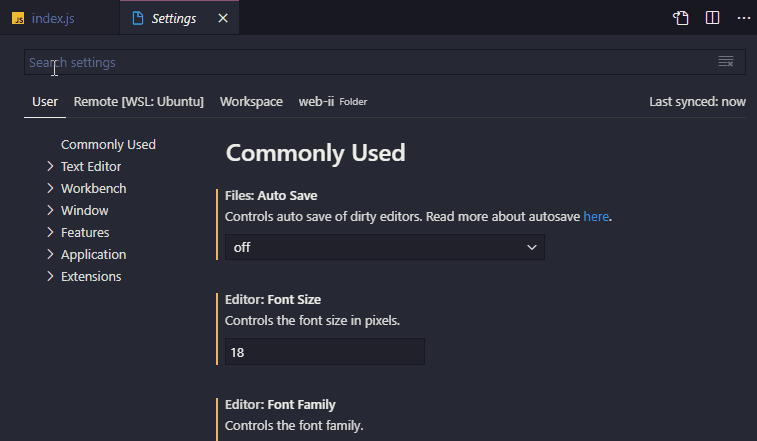
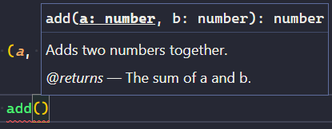

# 0.2 - Node Modules

## 🎯 Objectives

- **Differentiate** between a core, user-defined, and NPM module.
- **Use** core modules in a Node application.
- **Separate** out logical pieces of code using user-defined modules.
- **Use** modules that other developers have written using the Node Package Manager.

## 🔨 Setup

1. Open Visual Studio Code and open a terminal (`CTRL + ``).
2. Create a new folder `mkdir ~/web-ii/exercises/0.2-node-modules`.
3. Navigate inside that folder and create a file with the following name and contents: `pokemon.json`

```json
[
  {
    "name": "Bulbasaur",
    "nickname": "Leafster"
  },
  {
    "name": "Squirtle",
    "nickname": "WaterGuy"
  },
  {
    "name": "Charmander",
    "nickname": "Pyro"
  }
]
```

​	Replace the names with your favourite Pokemon if you’d like!


## 🔍 Context

When writing JavaScript that runs in a Node environment, there are three main places that code can live:

1. **Core Modules**: These are modules that come with Node by default.
2. **User-Defined Modules**: These are modules that we write ourselves.
3. **NPM Modules**: These are modules that other developers have written that we can pull into our own application to avoid “reinventing the wheel”.


## 🚦 Let’s Go

Before we start working with modules, there’s one thing I’d like to go through first…

### Type Checking

JavaScript is a **dynamically typed language**:

```javascript
let myNumber = 3;

console.log(myNumber + "5"); // JS will not complain here. It will coerce myNumber to be a string.

// Output: 35
```

It differs from languages like C# or Java which are **statically typed**:

```javascript
int myNumber = 3;

Console.WriteLine(myNumber + '5'); // C# compiler will complain about a type mismatch.

// Output: none
```

It’s easier to make a mistake while coding when using a dynamically typed language since you don’t have a compiler that will tell you any mistakes you made before you have a working version of your app. We can use features of our editor, Visual Studio Code, to help us while coding JavaScript.

1. Create a file called `type-check.js` inside the exercise directory.

2. Write a function called `add` that takes two numbers `a` and `b`, and returns the sum of `a + b`.

3. Declare a variable called `sum` and initialize it to the return value of calling the `add` function. Pass in a string for one of the parameters, and a number for the other.

4. Run `node type-check.js` and you should get see the number and the string you passed into `add` concatenated to each other.

5. Hit `CTRL + ,` (comma) to bring up the settings tab.

6. Search for *“check js”* using the search bar at the top.

   

2. Go back to `type-check.js` and you’ll notice that… nothing changed! What did that setting do? Basically, now we have the ability to write special comments called [*JSDoc annotations*](https://jsdoc.app/index.html) above our function definitions to describe the different parts of the function. Above the declaration of the `add` function, write the following:

​	

```javascript
/**
 * Adds two numbers together.
 * @param {number} a
 * @param {number} b
 * @returns {number} The sum of a and b.
 */
```

You should now see a red underline where you called the `sum` function. If you hover over it, it should say:

```
Argument of type 'string' is not assignable to parameter of type 'number'.
```


Call `add` again on a new line and as soon as you type `(` to start the invocation, you should see the description of the function:

​	

1. 
   - The types of the input parameters
   - The type of the return value
   - A description of what the function does
   - A description of what the return value represents

Hopefully you can agree that this is a nicer developer experience! The idea of adding static type checking to JS is more prevalent than you might know. Over the years, JS developers eventually got sick of JS not supporting types natively, so they created something called [TypeScript](https://www.typescriptlang.org/) which we’re going to start using as of next week.

Alright, now that that’s out of the way, on to modules!


### Core Modules

As we saw previously, the Node runtime gives JavaScript access to many objects and functions that JavaScript does not normally have. One example of this is Node giving JS access to the computer’s file system.

1. Head over to the [official Node docs](https://nodejs.org/docs/latest-v19.x/api/index.html), you’ll see a long list of things that we can do with Node. Click on the `File System` link, and you will see all of the functions we can use to manipulate the file system.
2. Scroll down and find `fs.writeFileSync(...)`. I want you to become familiar with how to utilize the official documentation of a technology [instead of going to StackOverflow all the time](https://www.goodreads.com/en/book/show/29437996-copying-and-pasting-from-stack-overflow).
   - You should see that `fs.writeFileSync(...)` can take three parameters. The first two are required, and the third is optional. The way to tell if a parameter is optional is because it will be wrapped in square `[]` brackets.
3. Create a new file called `app.js` inside the exercise directory.
4. Before we can call `fs.writeFileSync(...)`, we have to `import` the `fs` module first. At the top of the file, write:

```javascript
import fs from "fs";
```


5. Run `npm init -y` (we’ll talk about NPM later in this exercise) and it should create a `package.json` file.
6. Open `package.json` and add the following property:

```javascript
{
    "name": "src",
    "version": "1.0.0",
    "type": "module",
    ...
}
```


1. This will allow the `import` syntax from step 4 to work.
2. Using the information from the Node docs, see if you can write a string to a file called `core-modules.txt` using `fs.writeFileSync(...)`. It should be a one-liner.
   - To verify that a file was created properly, you can run `ls` in the terminal or refresh the VSC file explorer.
3. Once you’ve successfully written to a file, try reading the contents of the file using `fs.readFileSync(...)` and assign it to a variable.
4. Print the contents of the variable to the console. You’ll have to call `.toString()` on the variable in order for the string to be properly parsed.

To summarize, *core modules* are libraries that are available to us by default when using Node.

### User-Defined Modules

Right now our `app.js` is pretty small. Over time, as we add more complexity to our application, the codebase is going to grow pretty large. It’s not good practice to have many different pieces of your application all inside of one file. To split it up, we’re doing to define our own modules.

1. Create a file called `utilities.js`.

2. At the top of `utilities.js`, import the `fs` module as before.

3. Declare two functions: `readFromJsonFile(filename)` and `writeToJsonFile(filename, data)` using the proper [*JSDoc annotations*](https://jsdoc.app/index.html) like we did in the [Type Checking](https://vikramsinghmtl.github.io/420-4W6-Web-Programming-II/exercises/02-node-modules/#type-checking) section above. What we’re going to do is *extend* the functionality of the `fs` functions we’ve used so far.

4. Inside of `readFromJsonFile`:

   - Declare a variable called

      

     ```
     rawText
     ```

      

     and initialize it to the return value of calling

      

     ```
     fs.readFileSync
     ```

     .

     - The filename that you will pass to `fs.readFileSync` will be the one that you received from the `readFromJsonFile` input parameter.
     - Remember to call `.toString()` to get the actual text.

   - Declare another variable called

      

     ```
     parsedJson
     ```

      

     and initialize it to the return value of calling

      

     ```
     JSON.parse(rawText)
     ```

     .

     - `JSON.parse()` is a JS function that takes a string containing valid JSON syntax and turns it into an actual JavaScript object.

   - Return `parsedJson`.

5. Inside of `writeToJsonFile`:

   - Declare a variable called

      

     ```
     stringToWrite
     ```

      

     and initialize it to the return value of calling

      

     ```
     JSON.stringify(data)
     ```

     .

     - `JSON.stringify()` is a JS function that takes either an array or object and turns it into a string that contains valid JSON syntax.

   - Write the contents of `stringToWrite` to the filename you received from the `writeToJsonFile` input parameter.

6. Export the two functions:

	
	 ```javascript
export function readFromJsonFile(filename) {...}
export function writeToJsonFile(filename) {...}

​        What’s happening here is we are explicitly making available the two functions we wrote to anyone who imports this file.

7. Erase everything in `app.js` and import our new module at the top of the file:

   

   ```javascript
   import { readFromJsonFile, writeToJsonFile } from "./utilities.js";

> [!NOTE]
>
> - Note that we need the `./` at the beginning since this is a *user-defined module* and not a *core module*.
> - We also have to specify the `.js` file extension.

1. Declare a variable called `pokemon` and initialize it to the return value of calling `readFromJsonFile('pokemon.json')`.
2. At this point in the program, we should have successfully read the file and now have an array of objects to work with. Test that everything is working so far by running `console.log(pokemon)` and verify that it is indeed an array of 3 objects, each with a `name` property and a `nickname` property.
3. Once that is good to go, access the first object of the array and change the `nickname` property to a name of your choosing.
4. Call `writeToJsonFile('pokemon.json', pokemon)`.
5. Run the program and open `pokemon.json`. You should see that the nickname has been changed to the one you specified.

If you’ve gotten this far - awesome! We have now successfully used a *core module* and have also made our own *user-defined module*. Great job! 👍


### NPM Modules

> [!ATTENTION]
>
> **Package vs Module**
>
> We’ll be using the terms *package* and *module* interchangeably.

Even though there are many different core modules at our disposal when using Node, they are quite low level. You may use these low level libraries to build more interesting applications and packages - kind of like how we just did with taking the low level `fs` module and extending it a little bit to be able to work with JSON data. The truth is, whatever functionality we may want to code ourself, someone else has probably already done it! NPM (Node Package Manager) is a service where developers share useful packages.

1. Head over to [the NPM website](https://www.npmjs.com/).

2. Search for *json file reader*. You should see several libraries people have written that do exactly what we just did in this exercise. Even though there are packages that do exactly what we want, a lot of the time it is better to code things for ourselves so that we can practice and learn how to do things.

3. Now let’s search for *faker*. You should see a result by the author **division-by-zero**. If you click on it, you will see that this is a very popular package - 3.7 million downloads every week! What exactly does this package do? Well, a lot of the time when developing applications, we need fake data in order to test if the app is working properly. Instead of writing a package ourself to do this, we can leverage the work of this faker package.

4. How do we use it? Good question! Remember the `package.json` file we created before using the `npm init` command? If we were to submit our application to [the NPM website](https://www.npmjs.com/), it would extract all the information from this file in order to populate the package’s webpage.

5. Run `npm i @faker-js/faker`. After the package finishes installing, you should see a new property inside of `package.json` called `dependencies`. There should be one dependency listed called `@faker-js/faker`. You should also see a new folder in the exercise directory called `node_modules`. This new directory is where the code lives for the `@faker-js/faker` module.

6. To use this module in our application, let’s require it at the top of `app.js`:

   ```javascript
   import { faker } from "@faker-js/faker";
   ```

   > [!NOTE]
   >
   > Unlike when we imported our `utilities.js` module, we do not put the `.js` extension when importing NPM modules.

   

7. Instead of hardcoding a new nickname for our Pokemon, let’s use faker to generate a random name. How do we know what the correct syntax is, though? If only there was a place where all the information about this package was located[…](https://www.npmjs.com/package/@faker-js/faker) I challenge you to find the right syntax to use faker to generate random names!

8. Set a new randomly-generated nickname for all three pokemon in the array, and run the application a few times. Each time you run it, check `pokemon.json` to verify that the nicknames are being changed randomly.

## 📥 Submission

In `pokemon.json`, change one of the Pokemon names to your name. Run the program a few times and make sure to `console.log` the value of the `pokemon` array after the random names have been assigned. Take a screenshot of the output. I should see something like this:


Don’t worry that I have an extra `/Development-Environment/` in my path. My file structure is going to be a little different that yours! Yours should be `~/web-ii/Exercises/0.2-Node-Modules`. Submit the screenshot in the Moodle drop box called *Exercise 0.2 - Node Basics*.

------

Hopefully you found this process fun! It can be very satisfying when you get to use packages that other developers have written. It can definitely save us a lot of time, but it can also cause headaches if there is a bug. Since we’re now working with our code and someone else’s code simultaneously, it can be very time consuming trying to figure out where a particular bug is coming from… But that’s all part of being a developer! 🤓
