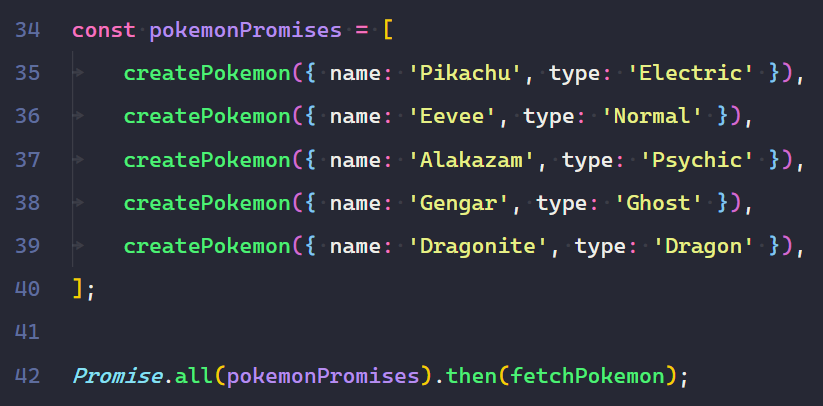

# 0.3 - Callbacks & Promises

## 🎯 Objectives

- **Differentiate** between callbacks, promises, and async/await.
- **Write** an asynchronous program using callbacks functions.
- **Write** an asynchronous program using promises.
- **Substitute** promising chaining with the `async` and `await` keywords.

## 🔨 Setup

1. Open Visual Studio Code and open a terminal (`CTRL + ``).
2. Create a new folder `mkdir ~/web-ii/exercises/0.3-callbacks-promises`.
3. Navigate inside that folder, run `npm init -y`, and add `"type": "module"` like previous times.
4. Create `pokemonDatabase.js` with the following contents:

pokemonDatabase.js

```json
export const pokemonDatabase = [

  { name: "Bulbasaur", type: "Grass" },

  { name: "Squirtle", type: "Water" },

  { name: "Charmander", type: "Fire" },

];
```

It doesn’t have to be Pokemon name/type! That’s just what I like. Feel free to use actor/movie, artist/album, author/book, or anything else that you find interesting.

## 🔍 Context

In E0.1 we saw how we can write _non-blocking/asynchronous_ JavaScript. This has traditionally been done through the use of _callback functions_. As you’ll experience through this exercise, callback functions are prone to a problem known as _callback hell_ where code becomes unreadable and unmaintainable very quickly. Promises were implemented to try and mitigate this problem.

What exactly is a `Promise` in JavaScript?

> [!TIP]
>
> From the [Mozilla developer docs](https://developer.mozilla.org/en-US/docs/Web/JavaScript/Reference/Global_Objects/Promise): The `Promise` object represents the eventual completion (or failure) of an asynchronous operation and its resulting value. A `Promise` is in one of these states:
>
> - **pending**: initial state, neither fulfilled nor rejected.
> - **fulfilled**: meaning that the operation was completed successfully.
> - **rejected**: meaning that the operation failed.


Courtesy of [Lydia Hallie](https://dev.to/lydiahallie/javascript-visualized-promises-async-await-5gke). Her article on this topic goes far more in depth than this exercise does. The article is eloquently written and I aspire to reach her level of diagrams. I highly recommend reading it (after finishing this exercise) if you’re curious about the nitty gritty of async programming in JS!

We’ll start by coding our own callback system to asynchronously create new Pokemon in a “database” (which will just be an array of objects) . From there, we’ll turn that into the equivalent structure using promises and explore how we can use promises for both sequential and simultaneous operations. Lastly, we’ll simplify the promise by using the `async` and `await` keywords.

## 🚦 Let’s Go

Note

Anytime a Pokemon is mentioned in the instructions, replace it with whatever entity you might have changed it to from the [setup](#-setup) section above.

### Callbacks

1. Create a file called `callbacks.js` in the folder for this exercise.

2. Import the `pokemonDatabase` from the file created in the [setup](#-setup) section above.

3. Declare a function named `fetchPokemon()`:

   1. This function will take no parameters.

   2. Declare a variable called

      ```
      fetchTime
      ```

      and initialize it to a

      random number

      between 1 and 500.

      - This number will control how long the `setTimeout`, outlined below, will take to execute.
      - The randomness is meant to mimic the fluctuation of network speeds.

   3. This function will print the contents of the `pokemonDatabase` to the terminal after `fetchTime` milliseconds go by. You should use the [setTimeout](https://developer.mozilla.org/en-US/docs/Web/API/setTimeout) function to achieve this.

4. Declare a function named `createPokemon(pokemon)`:

   1. This function will take one parameter: `pokemon` as an object.
   2. Declare a variable called `createTime` and initialize it to a [random number](https://www.w3schools.com/jsref/jsref_random.asp) between 1 and 500. This number will control how long the `setTimeout`, outlined below, will take to execute. The randomness is meant to mimic the fluctuation of network speeds.
   3. This function will push the `pokemon` object into the `pokemonDatabase` array after `createTime` milliseconds go by. You should use the [setTimeout](https://developer.mozilla.org/en-US/docs/Web/API/setTimeout) function to achieve this.

5. Call the `createPokemon` function and pass in an object that contains a `name` property and a `type` property. The values of these properties are up to you.

6. Call `createPokemon` again with a different object.

7. Call the `fetchPokemon` function.

8. Run the program in the terminal (`node callbacks.js`) several times. If you coded everything correctly until this point, you should see the new Pokemon being printed randomly upon each program execution:

   
This is because we’re using random values for fetchTime and createTime. If createTime is greater than fetchTime, it means that the createPokemon function will take longer to run. If it takes longer to run than fetchPokemon, then it should make sense that when fetchPokemon prints, it does not have the new Pokemon inside of pokemonDatabase to print, so it only prints the original three.

​	Ideally, we would like to have the new Pokemon displayed 100% of the time, and in the right order. How can we fix this problem? You guessed it, 	callbacks! 🤩
9. Modify the createPokemon function declaration to take a second parameter called callback.

10. Call the callback() after the new Pokemon has been inserted into the pokemonDatabase array.

11. Modify the first call to createPokemon such that you pass in a callback as the second parameter. That callback should invoke the second createPokemon where you pass in a new Pokemon object as the first parameter and the fetchPokemon function as the second parameter.

    

    > [!CAUTION]
    >
    > Take care **not to invoke** `fetchPokemon` (i.e. no parenthesis after ~~()~~) when passing it in. You’re giving `fetchPokemon` to `createPokemon` so that `createPokemon` may invoke `fetchPokemon` at some later point in time.

    

12. Run the program (`node callbacks.js`) several times now and confirm that the new Pokemon are being printed 100% of the time, and **in the same order** every time.


#### Callback Hell

The trouble with callback functions is that they can be nested quite easily. When your callback has its own callback that has its own callback, ad infinitum, you can imagine how deep the rabbit hole can go!


### Promises

Let’s see how we can get rid of *callback hell* by using promises.

1. Make a duplicate of `callbacks.js` and call it `promises.js`.

2. At the end of the `createPokemon` function, return a `new Promise()`:

   1. The promise will take one parameter as input: a callback function.
   2. The callback will take 2 parameters as input called `resolve` and `reject`.
   3. Move the `setTimeout` function entirely into the body of the promise’s callback.
   4. Change `callback()` to `resolve()` inside of `setTimeout`.
   5. Insert the push to database line inside the resolve.( i added this line.)
   6. Remove the `callback` parameter from the parameter list of `createPokemon`.

3. Remove the calls to `createPokemon` and `fetchPokemon` from the bottom of this file and replace them with one call to `createPokemon`, passing in the one Pokemon object it normally takes.

4. Now, because `createPokemon` returns a `Promise` object, we can call the `then()` method on it.

   - We can pass in a callback to `then()` and that callback will be invoked if the previous `Promise` was successfully **fulfilled**.

   - If the return value of the callback passed to `then()` returns a promise, we can **chain** another `then()` onto it. This second `then()` can take a new callback, which can return a promise, so we can chain another `then()`, ad infinitum.

     

5. Run this program (`node promises.js`) several times now and confirm that the new Pokemon are being printed 100% of the time, and **in the same order** every time.

#### Promise.all

Chaining promises using `then` is great if we want multiple operations to run sequentially, one after the next. However, by doing this, we lose the ability to have multiple operations run simultaneously, at the same time. Let’s look at how we can perform operations simultaneously using `Promise.all()`!

1. Make a duplicate of `promises.js` and call it `promise-all.js`.
2. Inside of `promise-all.js`, remove the block of chained promises from the end of the file.
3. Declare a new array called `pokemonPromises`. Each element of this array will be a call to `createPokemon`.
4. After the array, call `Promise.all(pokemonPromises)`. This function takes an array of promises, and waits for all promises in the array to be fulfilled. Once all promises in the array are fulfilled, `Promise.all` returns a promise of its own. We can call `then` on this returned promise to execute something after all the simultaneous operations have finished. In this case, we want to execute `fetchPokemon` after all the Pokemon have been created.
5. Run this program (`node promise-all.js`) several times and confirm that the new Pokemon are being printed 100% of the time, **but not** in the same order every time. It should make sense why the output is different each time you run the program. Since we are running all `createPokemon` operations **at the same time**, and each one of them takes a different time to run, we will get a different output each time.

​                                  


​        We can compare the time difference between sequential operations and simultaneous operations by using [`console.time()`](https://developer.mozilla.org/en-US/docs/Web/API/Console/time):

​					

The execution time was cut in half! 


### Async/Await

After a couple of years of using promises, JS developers found it cumbersome to have to chain the `.then()` calls. They’re definitely better than using callbacks, but it would be nice if we could write asynchronous code in the same way we write synchronous code. In an attempt to do this, the keywords `async` and `await` were born. These keywords are **syntactic sugar** for using promises.

> [!NOTE]
>
> Syntactic Sugar
>
> From [Wikipedia](https://en.wikipedia.org/wiki/Syntactic_sugar): Syntactic sugar is syntax within a programming language that is designed to make things easier to read or to express. It makes the language “sweeter” for human use: things can be expressed more clearly, more concisely, or in an alternative style that some may prefer.


1. Make a duplicate of `promises.js` and call it `async-await.js`.

2. Inside of `async-await.js`, remove the block of chained promises from the end of the file.

3. Declare a function called `createAllPokemon()`:

   1. In the body of the function, call  `createPokemon`, pass `createPokemon` a new object, but don’t call `then()` on `createPokemon`. Instead, add the keyword`await` in front of the call.

      - The `await` keyword is essentially a (nicer looking) replacement for using `then()`. The program will wait for this promise to be fulfilled before moving on with execution.

   2. Repeat this for several more calls to `createPokemon`.

   3. Finally, call `fetchPokemon`. Since `fetchPokemon` does not return a promise, we don’t have to `await` it.

4. We can only use `await` inside of a function that has been declared as `async`. To do this, write the keyword `async` before the function declaration.

5. Call `createAllPokemon` at the end of the file.
     
6. Run this program (`node async-await.js`) several times and confirm that the new Pokemon are being printed 100% of the time, and **in the same order** every time.


## 📥 Submission

Take a screenshot of all four programs being run with the time that each program took to execute and submit it on Moodle. Again, you can use [`console.time()`](https://developer.mozilla.org/en-US/docs/Web/API/Console/time) to accomplish this. Put `console.time('timer label')` before calling any function, and put `console.timeEnd('timer label')` inside of `fetchPokemon` just after it finishes printing all the Pokemon to the terminal.


Submit the screenshot in the Moodle drop box called *Exercise 0.3 - Callbacks & Promises*.

------

Asynchronous programming can be tough to wrap your head around, that’s for sure. Hopefully you can appreciate the advantages it provides and how it unlocks a whole other world of possibilities!
