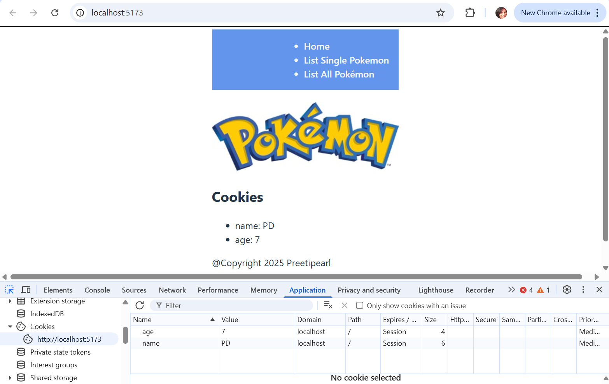
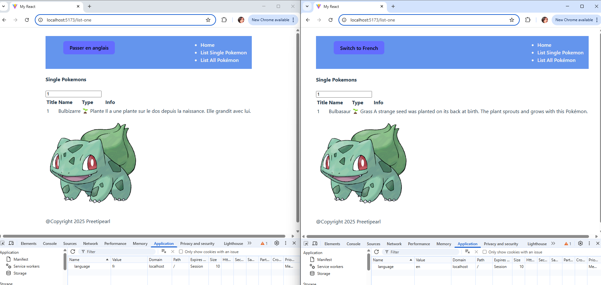
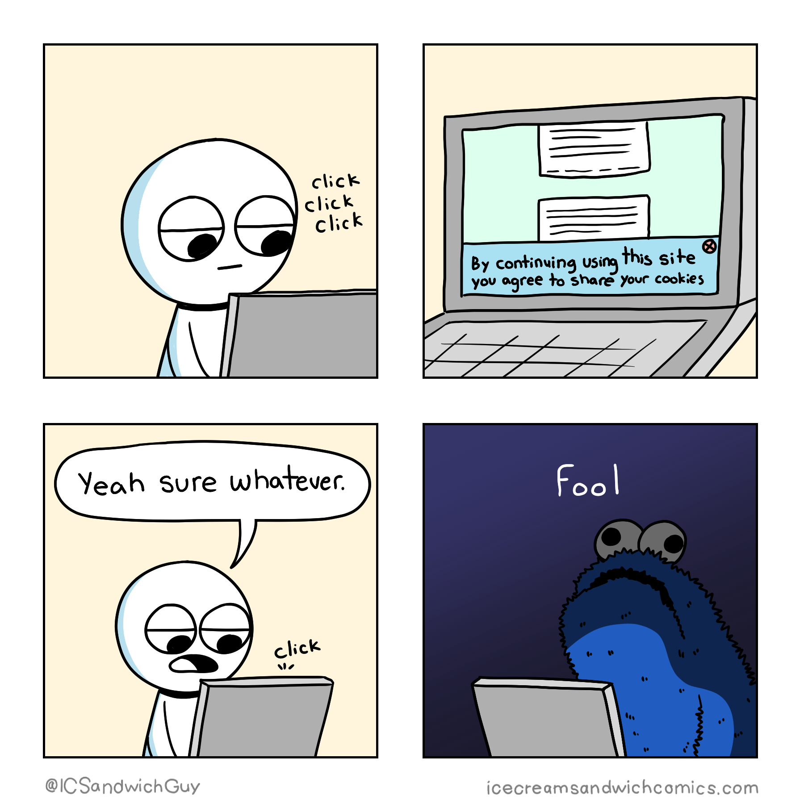

# 4.1 - Cookies

## 🎯 Objectives

- **Define** what an HTTP cookie is.
- **Explain** why and how to use cookies.
- **Receive** cookies from the client and process them on the server.
- **Set** cookies from the server and send them to the client.

## 🔨 Setup

1. Navigate to the [template repository](https://github.com/JAC-CS-Web-Programming-II-W25/E4.1-Cookies-Template) for this exercise and [follow these directions](https://docs.github.com/en/repositories/creating-and-managing-repositories/creating-a-repository-from-a-template#creating-a-repository-from-a-template) to fork it.
2. Assuming Docker is started, in VS Code, hit `CMD/CTRL + SHIFT + P`, search + run `dev container: open folder in container`, and select the downloaded folder.
3. Make time to go through the folder structure.
4. In VS Code, hit `CMD/CTRL + SHIFT + P` and search + run dev container: `open folder in container`
5. In the terminal of VS Code, hit the + icon to open a new terminal instance. 
6. Run ls to make sure you’re in the root directory of the exercise and you see client and server folders.
7. cd to client to run `npm run dev` to start the react server.
8. Open the website in the browser.
9. Make time to go through the folder structure.
>[!note]
>The npm install runs automatically when you open the container. Look at file
>`devcontainer.json`


## 🔍 Context

For a refresher, please read the [cookies chapter](../Notes/Week11/cookies.md). For the short version:

> Cookies are arbitrary pieces of data, usually chosen and first sent by the web server, and stored on the client computer by the web browser. The browser then sends them back to the server with every request, introducing states (memory of previous events) into otherwise stateless HTTP transactions. Without cookies, each retrieval of a web page or component of a web page would be an isolated event, largely unrelated to all other page views made by the user on the website. Although cookies are usually set by the web server, they can also be set by the client using a scripting language such as JavaScript (unless the cookie's HttpOnly flag is set).


## 🚦 Let's Go

### Part 1: 🍪 Basic Cookies


1. On the [homepage](http://localhost:5173) (the client side, the react page.), open the dev tools and go to where it displays the cookie information. There should be no cookies listed yet.
   - Chrome: Click on `Application` > `Cookies` > `http://localhost:5173`
   - Firefox: Click on `Storage` > `Cookies` > `http://localhost:5173`
2. Click the empty spot in the "name" column and type in `name` and press `Enter`. Do the same for the "value" column and type in `yourName` and press `Enter`. Repeat this process for the "name" column and type in `age`, then type in `yourAge` for the value.
   - Refresh the page and you should see the cookies listed in the body of the page.
   - You've just manually set a cookie in your browser! This is useful for testing purposes, but we'll be doing this programmatically in the next steps.

   

>[!tip]
>Look at the `CookieDisplay.jsx` component to  understand how the cookies are being accessed from the browser and rendered on the page in **React**.

3. Let's set a cookie programmatically now. Open the `controller.ts`, in the `gethome` call,  Just above where we call `response.end`, write:


```tsx
// just after the CORS headers.

	res.setHeader("Set-Cookie", [
		"likes=somethingYouLike;SameSite=Strict",
		"lovesWebDev=false",
	]);

	res.end(...);
```

   - We're setting a response header called `Set-Cookie`. The value for this header is an array containing two key/value pair strings, which are the cookies.
   - `SameSite=Strict` attribute is a security setting that ensures these cookies are not sent in **cross-site requests**.

To apply changes:
   - Restart the server to bring the changes into effect. Enter `rs` to restart the server.
   - Refresh the page **once**.
     -  In the **Developer Tools > Application > Cookies**, you should see **all four cookies** listed.
     -  On the page itself, you’ll only see the **first two cookies rendered**.

   - Refresh the page **again**.
     - Now you should see **all four** cookies listed in the dev tools, and **all four** rendered on the page.


>[!note]
>The client holds onto any cookies it created or cookies that the server sent back to it. The server only knows about the cookies that the client sends to it. If the server sends back a cookie that the client already has, the client overrides the one it has with the one the server sent. Using this information, can you determine why the last two cookies did not get rendered on the page during the first refresh?
   <details>
   <summary>Answer</summary>
>   1. **First request**: Client sends cookies 1 and 2 to the server.
>   2. **First response**: Server sends back cookies 3 and 4 to the client and renders **all request cookies** (1 and 2) on the page. 3 and 4 are not request cookies, they are response cookies.
>   3. **Second request**: Client sends cookies 1, 2, 3, and 4 to the server.
>   4. **Second response**: Server sends back cookies 3, and 4 to the client (not 1 and 2) and renders **all request cookies** (1, 2, 3, and 4) on the page. This time all 4 cookies are request cookies.
</details>


4. The next thing to know about cookies is that **the browser automatically sends any cookies that it possesses to the server when making a request**.
   1. To verify this, stick a `console.log(req.headers.cookie)` inside `getHome()`, restart the server (Enter `rs` to restart the server.) and then refresh the browser page to send another request.
   2. When the server receives the request,  you should see a property called `cookie`, and the cookies listed like this: ` 'name=PD; likes=somethingYouLike; lovesWebDev=false'`;
   3. The response is sent back to the client. You can refresh the page as many times as you want - we now have a mechanism to remember information between requests/responses!


### Part 2: 🗣️ Languages
---
We'll now build a small web app that uses a cookie to remember the language, English or French, in which the user wants to view the page so that you can experience a real-life use case for cookies. Take a look at the model and notice that we now have language data. This is the data we want to display on the page based on the language the user selects.

1. Using the dev tools, manually add a cookie `language` of value `"en"` . 
1. In the `getCookies()` function in `controller.ts`, follow the instruction in the comments to parse the cookie string and return an object with the key/value pairs of the cookies.
	- For example, if we had a cookie string like this: `name=yourName; age=yourAge`, the function should return an object like this: `{ name: 'yourName', age: 'yourAge' }`.
	- You can test this function by calling it inside `getHome()` so that it runs every time you refresh the homepage. You can then log the result to the console to see if it's working as expected.

>[!tip]
>
> 1. **Dynamic Object Naming**
>	You can use the square bracket notation to dynamically set the key of an object. For example:
>	```tsx
		const key = "name";
		const obj = {};
		obj[key] = "yourName";
		console.log(obj); // { name: "yourName" }
>```
>2. Look at the `CookiesDisplay.jsx`, see how the array is using reduce to save the key value in the object.Lookup `decodeURIComponent` and how you might want to use it on the values.


2. Once `getCookies()` is working, we can use the language cookie to determine which language to render the page in. We'll need to modify the `getHome()` function to do this.

   1. First, we need to get the language from the cookies object that `getCookies()` returns. If the language cookie doesn't exist, set either French or English as the default language.
   2. Determine which message to render ("Welcome!" or "Bienvenue!") based on the language cookie. If the language cookie is `fr`, we should use the French message. If it's `en`, we should use the English message.
   3. Set the `Set-Cookie` response header to be sent back to the client with the language cookie. This way, the client will remember the language it selected.
   4. Send the message to be rendered in the `Home.jsx` component.
   5. Refresh the page and see the message change based on the language cookie, or the default language if the cookie doesn't exist.
   6. Using the dev tools, manually change the language cookie ("en" or "fr") to test if the message changes accordingly upon refresh.

3. Once `getHome()` is working, we can do a similar process for `getOnePokemon()`. We want to render the Pokemon's name in the language that the user selected. The language cookie should be used to determine which language to render the Pokemon's name in.

   1. Get the language from the cookies object that `getCookies()` returns. If the language cookie doesn't exist, set either French or English as the default language.
   2. Determine which language to render the Pokemon's name in based on the language cookie. If the language cookie is `fr`, we should use the French name. If it's `en`, we should use the English name.
   3. Set the `Set-Cookie` response header to be sent back to the client with the language cookie. This way, the client will remember the language it selected.
   4. In `ShowView.jsx`, the data is currently using only the `en` version. Remove all mentions of `.en` replace them with just the property name. For example, `{{ pokemon.name.en }}` should be `{{ pokemon.name }}`.
   5. Send the Pokemon's name, using either the English or French property on the model/database object, to be rendered in the `FetchOne` component.
   6. Refresh the page and see the Pokemon's name change based on the language cookie, or the default language if the cookie doesn't exist.
   7. Using the dev tools, manually change the language cookie ("en" or "fr") to test if the Pokemon's name changes accordingly upon refresh.
   8. Do the same for the `type` and `info` properties.
   9. Remove the cookies from the response payload so that they don't display on the homepage anymore.

4. Once `getOnePokemon()` is working, we can do a similar process for `getAllPokemon()`.
  - See if you can figure out how to do this on your own. If you get stuck, ask for help!

  > [!tip]
  > Use the JS `map()` array function to loop through each Pokemon in the `database` array and create a new array of Pokemon objects with the `name`, `type`, and `info` properties in the language that the cookie specified.

5. We can't expect the users of our app to know that they can change the language by manually editing their cookies using the dev tools. There should be some sort of interface for this.

   Update the component `LanguageSelector.jsx` and use this component on your app. I used a button, feel free to use a dropdown or any other mechanism. 

   ```jsx
   //LanguageSelector.jsx. 
   	return (
   		<div className="flex flex-col items-center gap-4 p-4">
   			<button onClick={toggleLanguage}>
   				Toggle language
   			</button>c
   		</div>
   	);
   ```

   1. When the user toggles the language by clicking the button, it updates the `language` cookie and reloads the page to apply the change. Since the language is stored in a cookie, it persists across sessions. 
   
>[!note] 
>Updating the language **on the server side is not necessary** in your case because **React handles it entirely using cookies**. Since the language preference is stored in the **browser’s cookies**, the server does **not** need to process a `POST /language` request unless:
> 	✅ If the server must store the language preference in a database (e.g., for user accounts).
> 	✅ If the language preference affects server-side rendering (SSR) (e.g., Next.js with internationalization).
> 	✅ If the language needs to be included in API responses(e.g., translating data before sending it to the frontend).


7. Once you're able to change the language using the dropdown menu, you can remove the manual cookie setting in the dev tools and test the app by changing the language using the dropdown menu. Test changing languages on each page to verify that the language is being remembered and displayed correctly.


### Part 3: 👑 Bonus Challenges
---
1. **Ensure the `<button>` reflects the correct language on page load.**
    For example, if the `language` cookie is `"fr"`, the button should display `"Passer en anglais"` instead of `"Switch to French"`.
2. **Update the button label dynamically when the language is toggled.**
    When the user switches to French, the button text should change from `"Switch to French"` to `"Passer en anglais"`—and vice versa for English
3. The titles in the nav bar reflect the language.

<div style="position:relative; width:100%; height:0px; padding-bottom:62.500%;">
	<iframe allow="fullscreen;autoplay" allowfullscreen height="100%" src="https://pdmelo.github.io/4W6-Winter-2025/images/4.1.2-demo.mp4" width="100%" style="border:none; width:100%; height:100%; position:absolute; left:0px; top:0px; overflow:hidden; border-radius: 5px; ">
	</iframe>
</div>

## 📥 Submission

Take a screenshot of 2 browser windows side-by-side where one window has the English version of a page, and the other has the French version. Make sure to have the dev tools open in both windows to show the cookies.



If you want to get fancy and record a tiny video like the one above, you can do so using the screen recorder for [Mac](https://support.apple.com/en-us/102618) or [Windows](https://www.microsoft.com/en-us/windows/learning-center/how-to-record-screen-windows-11).

Submit the screenshot/video on Moodle.

[](https://icecreamsandwichcomics.com/post/157923361474/you-are-only-making-him-more-powerful-full-image)
