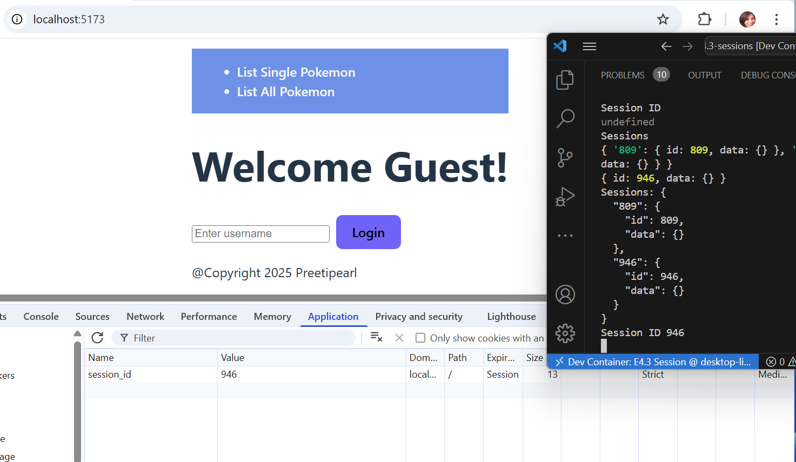

# 4.3 - Sessions

## 🎯 Objectives

- **Explain** how server-side sessions maintain user-specific data across requests.
- **Implement** authentication routes (login, logout) that create, manipulate, and destroy sessions.
- **Protect** specific routes based on session data.
- **Implement** a session expiration system to clear session data after a certain amount of time has passed.

## 🔨 Setup

1. Open your terminal and navigate to your ~/web-ii/exercises/ directory

2. Navigate to the [template repository](https://github.com/JAC-CS-Web-Programming-II-W25/E4.3-Sessions-Template)  and click Code -> 📋 to copy the URL:

   ```bash
   git clone <paste URL here>
   ```

   

3. Rename the cloned folder to `~/web-ii/exercises/4.3-sessions/`

4. Assuming Docker is started, in VS Code, hit `CMD/CTRL + SHIFT + P`, search + run `dev container: open folder in container`, and select the downloaded folder.

5. In the terminal of VS Code, hit the `+` icon to open a new terminal instance. Run `ls` to make sure you’re in the root directory of the exercise and you see `client` and `server` folders.

6. cd to `client` to run `npm run dev` to start the react server.

7. Open the website in the browser.

8. cd to `server`Run `npm run server` inside a JavaScript debug terminal to start the server.


## 🔍 Context

In the last exercise, we learned about sessions and cookies and how  we can use server-side sessions to store data on the server that is associated with a user's visit to a website. Sessions are typically implemented using cookies, but the session data is stored on the server, not the client's browser. This makes sessions more secure, as the client only has access to the session ID, not the session data itself.

In this exercise, we will implement a basic session system that allows users to log in and log out of a website. We will use sessions to store information about the user, such as their name, and restrict access to certain parts of the website to only logged-in users.

## 🚦 Let's Go

### Part 1: 🍪 Basic Sessions

1. Let's first understand the way sessions are implemented in this exercise. Open `sessions.ts` on the server side in the `src` folder.

	```tsx
	// session.ts
	interface Session {
		id: string;
		data: Record<string, any>;
	}

	const sessions: Record<string, Session> = {};

	const createSession = (): Session => {
		return {
			id: Math.floor(Math.random() * 1000),
			data: {},
		};
	};
	```

	- The `Session` interface defines the structure of a session object where we store the session ID and the session data.
	- The `sessions` object is a dictionary that stores session objects with their IDs as keys. Recall that a _dictionary_ is a collection of key-value pairs which we implement in TypeScript using the [Record type](https://www.typescriptlang.org/docs/handbook/utility-types.html#recordkeys-type).
	- The `createSession()` function generates a new session object with a random ID and an empty data object.

2. The `getSession()` function retrieves the session object associated with the user's visit to the website. If the user has a session ID cookie, the function retrieves the session object from the `sessions` object using the session ID. If the user does not have a session ID cookie (ex. first login to the site), the function creates a new session object and sets the session ID cookie to the new session's ID.

	```ts
	// session.ts
	export const getSession = (req: IncomingMessage) => {
		const sessionId = getCookies(req)["session_id"];
		let session: Session | undefined;
	
		if (sessionId) {
			session = sessions[sessionId];
		}
	
		return session;
	};
	```
	
3. Inside the `getHome()` controller function, follow the steps outlined in the comment. After you retrieve the session object, you can set a session cookie using the `Set-Cookie` response header we learned how to use in [E4.1](/Notes/Week11/41-cookies?id=part-1-🍪-basic-cookies).
4. Once that's done, refresh the page and verify that there is a cookie with the session ID in the browser's dev tools. Take note of the session ID value.
5. Refresh the page again and verify that the session ID cookie is still present and has the same value. Also verify that the sessions object is being logged to the terminal on each request.




>[!note]
>**Key Takeaways**
>
>1. Sessions are a way to store data on the server that is associated with a user's visit to a website.
>2. Sessions are typically implemented using cookies.
>3. The session ID is stored in a cookie on the client's browser.
>4. The session data is stored on the server.
>5. The session ID is used to retrieve the session data from the server.


### Part 2: 🔓 Logging In


1. Now that we have a working session mechanism in place, let's implement a login system. Note that sessions are normally set in place when a user logins, Sessions are not generated when a page is loaded. 

1. **Cleanup:**


   1. In the `gethome()` controller function. Comment out the code added in Part 1. The code that gets the session and sets the Cookie header with the session id.

   1. In the `session.ts `comment out the code that create a new session in the `getSession` function. Now we will create a new session id only when the user logs in.

      ```
      // else {
      	// 	session = createSession();
      	// 	sessions[session.id] = session;
      	// }
      ```

      

1. Lets  Add the following code to the `Home.jsx` component:

  ```jsx
  <!-- home.jsx -->
  <>
  	<input
  	type="text"
  	value={userName}
  	onChange={(e) => setUserName(e.target.value)}
  	placeholder="Enter username"
  	style={{ marginRight: "8px" }}
  	/>
  
  	<button onClick={handleLogin}>Login</button>
  </>
  ```

  - The form has a single input field for the user's name and a submit button. Normally we'd have a password field as well, but for simplicity, we're only asking for the user's name.
  - The form sends a POST request to the `/login` route when submitted.

2. Create a new route to handle this request and wire it to the `login()` controller function. Then, follow the steps inside the `login()` function to allow the user to log in.
3. Modify `home.jsx` , create a login handler to fetch information from server, to display a welcome message with the user's name if they are logged in by using the `isLoggedIn` and `name` properties of the session object, if they exist.

<div style="position:relative; width:100%; height:0px; padding-bottom:62.500%;">
<iframe allow="fullscreen;autoplay" allowfullscreen height="100%" src="https://pdmelo.github.io/4W6-Winter-2025/images/4.3.2-Sessions.mp4" width="100%" style="border:none; width:100%; height:100%; position:absolute; left:0px; top:0px; overflow:hidden; border-radius: 5px; ">
	</iframe>
</div>


4. Next let's only allow logged-in users to add Pokemon to the database. In the `getAllPokemon()` controller function, follow the steps outlined in the comment to only display the form if the user is logged in.
    This will also require modifying the `DisplayAll.jsx` template to only display the form if the user is logged in.
5. To test if the login system is working, start with being logged out. Since everytime the server is restarted it clears all session data, you can simply restart the server to log out. 
6. Next let's only allow logged-in users to add Pokemon to the database. 
7. There's a glaring flaw with our design though! Just because there is no form to add Pokemon, doesn't mean a user can't send a POST request to the `/pokemon` route. Try sending a POST request to the `/pokemon` route using [cURL](../../references/curl/#post-requests). You'll notice that you can still add Pokemon to the database even if you're not logged in. To fix this, follow the comment in the `createPokemon()` controller function to only allow logged-in users to add Pokemon.


Here is curl command example , to verify you can can add new pokemon  when logged in . Make sure you logged in first, and get the session cookie. Then try this command.

```bash

curl -v -X POST -H "Content-Type:application/json"  -b "session_id=your-sessionID" -d '{"name":"Meow","type":"Grass"}' http://localhost:3000/pokemon 
```


> [!note]
> **Key Takeaways**
>
> 1. A login system allows users to authenticate themselves to a website.
>
> 2. Sessions are used to store information about the user's authentication status.
> 3. The session object stores information about the user, such as their name, to personalize the user's experience on the website.
> 4. The session object can be used to restrict access to certain parts of the website to only logged-in users.


### Part 3: 🔒 Logging Out

1. Implement a logout system by adding a logout button to the `home.jsx`. Display the Logout if logged in .The button should send a GET request to the `/logout` route.

	```jsx
	<!-- home.jsx -->
		<>
			<button onClick={handleLogout}>Logout</button>
		</>
	```

2. Create a new route to handle this request and wire it to the `logout()` controller function. Then, follow the steps inside the `logout()` function to allow the user to log out.
	- To make the [cookie expire](https://pdmelo.github.io/4W6-Winter-2025/#/Notes/Week11/cookies?id=%e2%8f%b3-expires-and-max-age), set the `Expires` attribute of the `Set-Cookie` header to a date in the past.

	```ts
	new Date(new Date().getTime() - 5000).toUTCString();
	```

	For example, this returns a date 5 seconds in the past, and returns a string that can be used as the value of the `Expires` attribute.

3. Verify that the user can be logged out.
	1. Log in with a name.
	2. Note the session ID.
	3. Log out, and check that the session IDis cleared on the browser.


To really understand how the new session is being set after logging out, let's walk through the following scenario:

| Request | Client Cookie | Server Cookie | Description |
|---------|---------------|---------------|-------------|
| POST `/login`  | `{}` | `{123}` | Client logs in, server redirects to the homepage with session cookie 123. |
| GET `/` | `{123}` | `{123}` | Client performs the redirect and sends the cookie with the request. Server responds OK with the cookie back. |
| GET `/logout` | `{123}` | `{---}` | Client logs out, server sets expired cookie, client deletes expired cookie.Client redirect to the logout |

>[!note]
>**Key Takeaways**
>
>1. A logout system allows users to de-authenticate themselves from a website.
>2. Logging out invalidates the session ID cookie, forcing the user to log in again to access restricted parts of the website.
>3. Logging out is important for security reasons, as it prevents unauthorized access to a user's account.


### Part 4: 👑 Bonus Challenge

When you logged out, you might have noticed that session data is not being cleared. This is because we are only clearing the session ID cookie, not the session data on the server. This means if someone got a hold of the session ID, they could still access the website as if they were logged in.

<div style="position:relative; width:100%; height:0px; padding-bottom:62.500%;">
<iframe allow="fullscreen;autoplay" allowfullscreen height="100%" src="https://pdmelo.github.io/4W6-Winter-2025/images/4.3.3-HIjacking.mp4" width="100%" style="border:none; width:100%; height:100%; position:absolute; left:0px; top:0px; overflow:hidden; border-radius: 5px; ">
	</iframe>
</div>

This phenomenon is known as [**session hijacking**](https://en.wikipedia.org/wiki/Session_hijacking). To defend against this kind of attack, implementto  to clear session data once the user logs out.

## 📥 Submission

Take a screenshot after you log in so that your name is displayed in the welcome message. Make sure to have your browser's dev tools open to the `Application` tab showing the session ID cookie, and the server terminal open on the side showing the session data object.


Submit the screenshot on Moodle.

---

