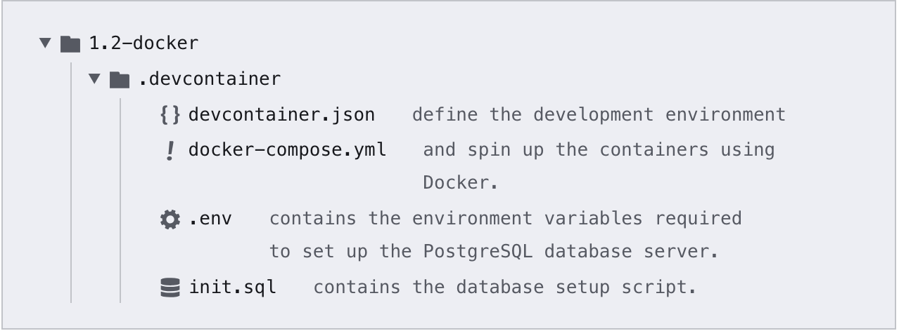
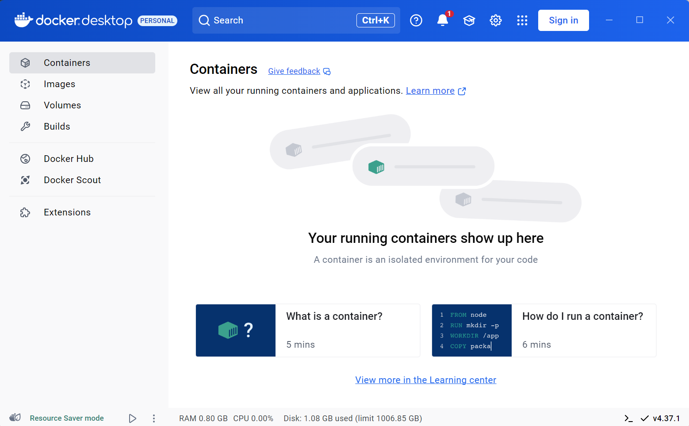
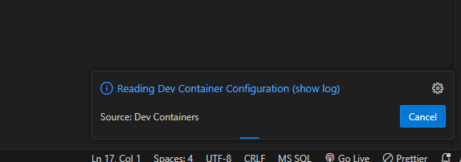
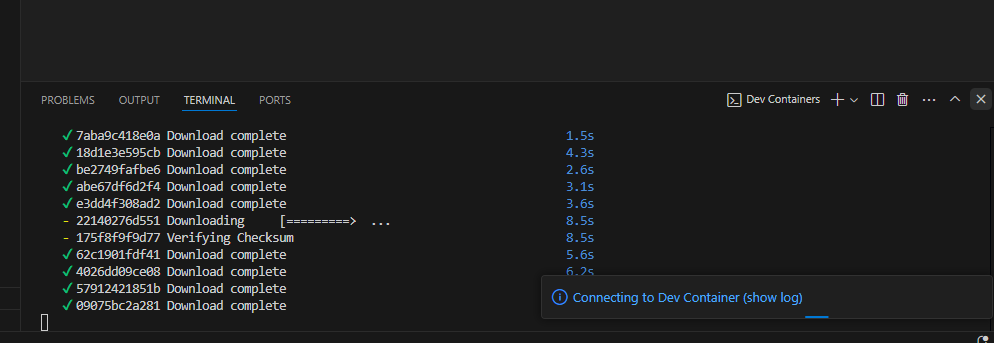
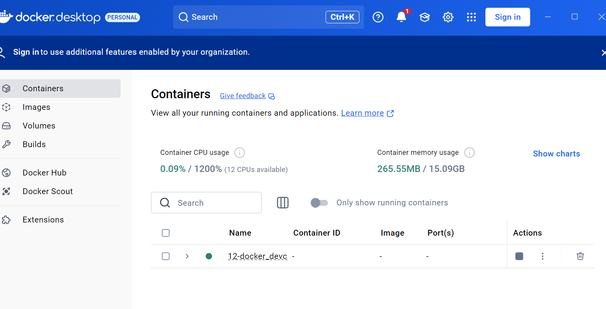
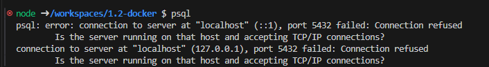

# 1.2 - Docker

## 🎯 Objectives

- **Explain** what Docker is and what it is used for.
- **Set up** a Docker container running a PostgreSQL database server.
- **Connect** to the PostgreSQL server with the PSQL client.
- **Execute** SQL statements on a PostgreSQL database.

## 🔨 Setup

1. Using the terminal, navigate to your `~/web-ii/exercises/` folder that you created for the first three exercises.

2. Go to [the repository for this exercise](https://github.com/JAC-CS-Web-Programming-II-W25/E1.2-Docker-Template) and click `Code -> 📋` to copy the URL.

   

3. Clone the Git repo from the CLI `git clone <paste URL from GitHub>` (without the angle brackets) or using a GUI client like [GitHub Desktop](https://desktop.github.com/).

   - You may have to use the `HTTPS` or `SSH` URL to clone depending on your settings. If one doesn’t work, try the other by clicking `Use SSH` or `Use HTTPS` above the 📋, and copy the new URL.

4. Rename the cloned folder to `~/web-ii/exercises/1.2-docker/`.
    


>[!CAUTION]
>
>Notice that `.devcontainer/` starts with a dot `.`. You should be able to see this folder in VS Code, but make sure you can see hidden files/folders on whichever OS you’re using.

Go through each of these files and read the comments I’ve left for you to understand what role each of the files plays when configuring the environment.

5. Lastly, make sure the Docker Desktop application is open.

   - If you’re running Docker Desktop for the first time, skip all the initial screens and continue without making an account.

   - It won’t look exactly like this but this is roughly what you should see when you open Docker:
     

     

## 🔍 Context

Before continuing, make sure to:

1. Understand how [Docker](/Notes/Week2/docker) works.
2. Set up your [development environment](/Guides/environment-setup).

## 🚦 Let’s Go

1. In VS Code, open the repo you cloned 

   ```
   ~/web-ii/exercises/1.2-docker/
   ```

   

   - Make sure to open the `1.2-docker/` folder and not the containing `exercises/` folder. This is because the `.devcontainer/` folder needs to be in the root of the project for VS Code to pick up on it.

2. Open `.devcontainer/init.sql`.

3. Choose an entity you want to represent in the database and edit the file accordingly.

   - For example, you could have a `BookDB` that contains a `book` table with `author` and `title` columns.
   - Whatever you choose, make sure you replace all instances of `something` with your entity, and replace `attribute1` and `attribute2` with the attributes you chose for your entity, making sure that `attribute1` is something that should be unique about your entity. In the example above, that could be `author`.
   - Save the file once finished.

4. [Assuming the `Dev Container` extension](../Guides/environmentsetup?id=%f0%9f%92%bbvs-code) is installed, hit Ctrl or ⌘ + Shift + P
   and search for `Dev Container: Open Folder in Container`. Select the folder for this exercise, which is `1.2-docker`
   
   - On the bottom right you will be prompted to open the logs, please do so in case there are any errors.
   
   - VS Code will then restart and continue spinning up the containers. It will again ask you if you want to open the logs, and you will again do so.
   
   - If all goes well, the logs should stop and you should see a bunch of messages about extensions being successfully installed.
   - You should also see `>< Dev Container: Web II @ desktop-linux` in the bottom left corner.
   - And this is how the docker desktop will display your container.
   
   
5. Open a terminal.
   
   - If a terminal was not already open, hit Ctrl or ⌘ + Shift + `.

   - If one was already open, in the header of the terminal panel, click the `+` icon which will open a new terminal instance.
   
6. From one of the terminal windows, run `psql`. You should see your prompt change to something like this: `postgres=#`. This means you are now connected to the PostgreSQL server container!
>[!TIP]
>if you see this error
>
>restart the docker
>Click on the `>< Dev Container: Web II @ desktop-linux` close remote connection
>Reopen in the container


7. Run `\l` (**l**ist) to display the list of databases. `YourDB` (the name will be whatever you named it in step 2) should be one of them if the initial setup script ran successfully.

8. Run `\c YourDB` (**c**onnect) to select that database.

9. Run `\dt` (**d**isplay **t**ables) to display the list of tables. There should be one table with the name that you chose in step 2.

10. You can now run any DDL/DML operations you want from here. Perform the following operations:

      1. `INSERT` a new entity.
    
      2. `SELECT` the entity that was inserted.
    
      3. `UPDATE` the entity to have a different field value.
    
      4. `SELECT` the same entity to verify the name was changed.
    
      5. `DELETE` the entity.
    
    
>[!CAUTION]
>
>**MySQL vs PostgreSQL**
>You probably used MySQL in your database course last semester. Each database engine (MySQL, PostgreSQL, MS SQL Server, etc.) has its own unique flavour of SQL. The main thing to know about PostgreSQL is that **identifiers** use **double quotes** and **string values** use **single quotes**. So, table `"pokemon"` might have column `"name"` with a value of `'Bulbasaur'`.

11. Run all 5 operations in sequence and take a screenshot of the output so that I can see **all 5 statements were run successfully**.

    

## 📥 Submission

Submit the screenshot you took to the Moodle dropbox for this exercise.

------

You’re now ready to use a real deal database for the applications we’ll write in this course! Hopefully you can appreciate that we’re using Docker to run everything database-related. By using containers, we can install and run any application in an isolated environment so that when we’re done, we just have to delete the container. It makes for a very clean developer experience! 