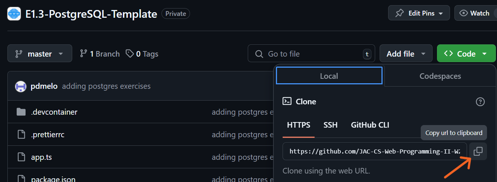
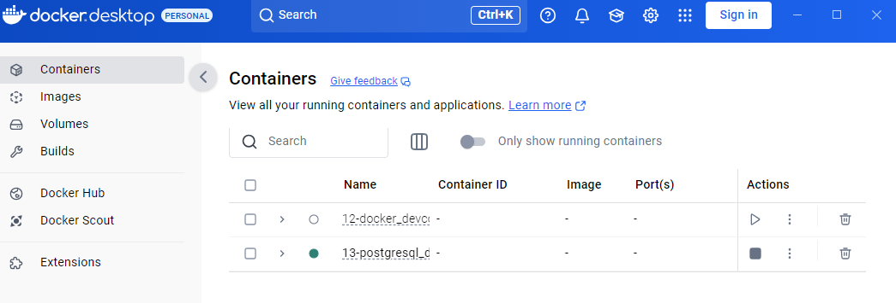
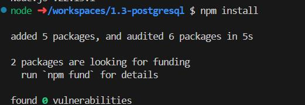
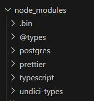

# 1.3 - PostgreSQL

## 🎯 Objectives

- **Execute** SQL statements using Node/TS on a PostgreSQL database.
- **Use** prepared statements to mitigate SQL injection attacks.

## 🔨 Setup

1. Using the terminal, navigate to your `~/web-ii/exercises/` folder.

2. Go to [the repository for this exercise](https://github.com/JAC-CS-Web-Programming-II-W25/E1.3-PostgreSQL-Template) and click `Code -> 📋` to copy the URL.

   

3. Clone the Git repo from the CLI `git clone <paste URL from GitHub>` (without the angle brackets) or using a GUI client like [GitHub Desktop](https://desktop.github.com/).

   - You may have to use the `HTTPS` or `SSH` URL to clone depending on your settings. If one doesn’t work, try the other by clicking `Use SSH` or `Use HTTPS` above the 📋, and copy the new URL.

4. Rename the cloned folder to `~/web-ii/exercises/1.3-postgresql/`.

   ```
   1.3-postgresql/
   
   ├── app.ts
   
   ├── package.json
   
   └── tsconfig.json
   ```

   - `app.ts`: The file in which we’ll write our code.

   - `package.json` : The configuration file that the `npm install` command looks for. This file is responsible for keeping track of which external packages our app needs.

     - The most important external package here is called [`postgresql.js`](https://github.com/porsager/postgres). This will allow us to execute commands on the database from our TypeScript code.

   - `tsconfig.json`: The configuration file for TypeScript which contains compiler options that define how TypeScript should compile your code. Go through this file and read the comments I’ve left for you to understand what role each of the lines plays when configuring the TypeScript compiler.

5. Ensure Docker Desktop has started.

6. Copy the `.devcontainer/init.sql` file from E1.2 and paste it into the `.devcontainer/` folder for this exercise.

7. In VS Code, hit `CMD/CTRL + SHIFT + P` and search + run `dev container: open folder in container`.

   This is how your docker will show the new container.

   

8. In the terminal of VS Code, hit the `+` icon to open a new terminal instance. Run `ls` to make sure you’re in the root directory of the exercise and that you see `package.json`.

9. Run `npm install` to install all our dependencies.

   You should see this when its complete

   

   And new folder in your directory node_modules

   

## 🔍 Context

In E1.2, we set up the development environment using Docker to spin up our containers. One for running our application code, and one for running our database server. We used the PSQL client to connect to the database and execute SQL commands.

In this exercise, we’re going to do the same thing, but with TypeScript instead of running the commands directly in the database. The first thing to do is open `app.ts` and notice at the top is a module we’re importing: [postgresql.js](https://github.com/porsager/postgres). This library is going to allow us to connect to the PostgreSQL database we’re running in our Docker container.

## 🚦 Let's Go
1. Click the icon right next to the `+` terminal icon of the two rectangles stacked up on each other. This will open another new terminal instance and split the view so that we can see both terminals at the same time.

2. In the new terminal, run `psql` to connect to the server, and then `\c YourDB` to connect to the database. You can use this terminal to check if our code later is doing what we want it to.

3. Open `app.ts` and change `YourDB` with the database’s name. To test, put a `console.log()` statement and run the file.
	- Run `tsx app.ts` in the terminal which is NOT running `psql`. You should see your `console.log()` statement print.
4. Declare an [interface](https://www.learn-ts.org/en/Interfaces) that represents the database table schema.

5. Declare a variable using the interface as the type and initialize it with values that make sense for the database entity. We want to use these values to perform an `INSERT` statement on our database using postgresql.js.

6. To perform this INSERT, use the [postgresql.js documentation](https://github.com/porsager/postgres?tab=readme-ov-file#usage) to figure out how to execute an SQL command on the database.
	>[!CAUTION]
	>**Reading Documentation**
	>
	>**Reading is a critical skill in software development**, I cannot overstate this enough. If you want to be a professional developer, you must learn how to be effective at reading technical documentation. Reading will be a significant portion of your job. Part of why I chose this library is because the documentation is beginner-friendly and easy to grok.

7. Find out using the [documentation](https://github.com/porsager/postgres?tab=readme-ov-file#usage) on how you can get the newly inserted row’s ID. [Here’s](https://www.postgresql.org/docs/current/dml-returning.html) another hint.

8. Once we’ve successfully inserted a new row into the database using TypeScript/postgresql.js and have retrieved the newly inserted ID, write:

```ts
app.ts
// Assuming we put the ID in a variable called id.
console.log(`Newly inserted row ID: ${id}`);
```

9. Write a `SELECT` statement to retrieve the row we just inserted by its ID, then print the result:

```ts
app.ts
// Attributes 1/2 being the ones we originally declared in our schema.
console.log(`Selecting row with ID ${id}: ${attribute1}, ${attribute2}`);
```

10. You can stop here and submit if you’d like. If you’re ambitious, then see if you can do `UPDATE` and `DELETE` as well! It shouldn’t be too much harder if you’ve managed to get this far.

11. Take a screenshot of your VS Code after your script has run. I should be able to see your code, as well as all the console.log() statements to show me all the operations were completed successfully.

📥 Submission
Submit the screenshot in the Moodle dropbox for this exercise.