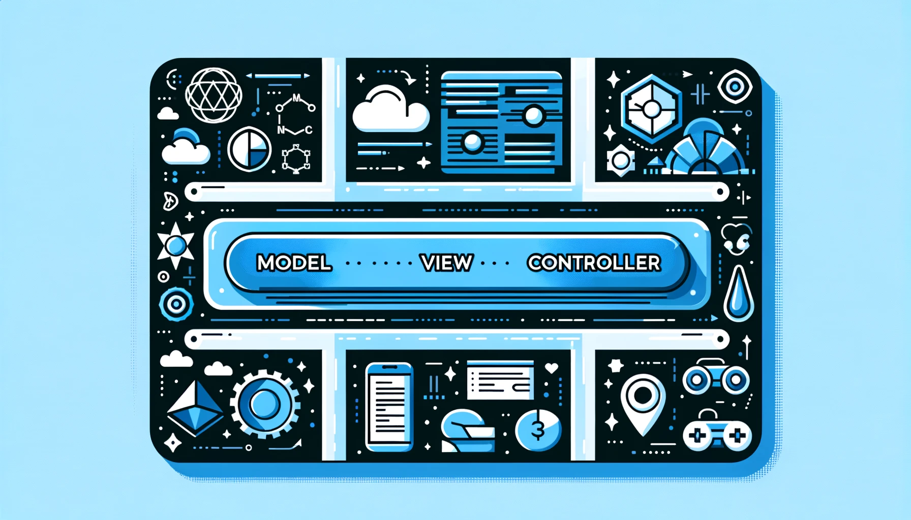

# Model View Controller

## Overview

The Model-View-Controller (MVC) pattern is a software design pattern commonly used for developing user interfaces. It divides the program logic into three interconnected elements. This separation helps in managing complexity, particularly in large applications, and facilitates ease of maintenance and scalability.

|                  | Model                                                        | View                                                         | Controller                                                   |
| ---------------- | ------------------------------------------------------------ | ------------------------------------------------------------ | ------------------------------------------------------------ |
| Definition       | Represents the data and the business logic of the application. It manages the rules, logic, and functions of the application. | Represents the UI components. It displays the data to the user and sends user commands to the controller. | Acts as an interface between Model and View. It listens to the user input through the view and processes the data before updating the view or model. |
| Responsibilities | - Store data that is retrieved according to commands from the controller and displayed in the view. - Respond to requests for information about its state (usually from the view). - Respond to instructions to change state (usually from the controller). | - Display the data provided by the model in a specific format. - Send user commands to the controller. | - Process all the business rules and incoming requests, manipulate data using the Model component, and interact with the Views to render the final output. - Handle user input from the View. |

## Analogy

Think of the MVC pattern like a video game system.

1. **Model - The Game Logic**: This is like the game’s world, rules, and everything that happens in the background. It’s the part of the game that you can’t see but is constantly working. It keeps track of your scores, the game rules, what level you’re on, and so on. Just like in a game, the Model in an app holds the data, the rules, and the logic. It’s where all the important stuff happens, but it’s not what you see on your screen.
2. **View - The Graphics and Display**: This is like the graphics of the game – the part you see on your screen. It’s the user interface. In a game, this would be your game environment, characters, menus, score display – everything visual. In an app, the View is similar; it’s everything the user interacts with on the screen. It takes information from the Model and displays it to the user in a friendly way.
3. **Controller - The Game Controller**: This is like the controller you hold when you play a game. It takes your inputs (like moving the joystick or pressing a button) and tells the game what to do. In an app, the Controller is like the middleman between the Model and the View. It takes the user’s inputs or actions, processes them (maybe following some rules or making decisions), and then updates the Model or the View accordingly.