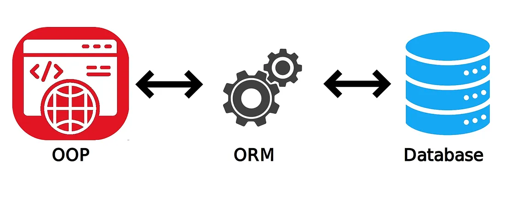
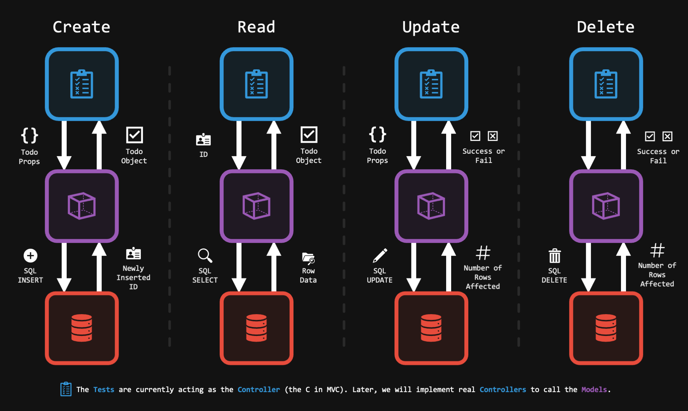
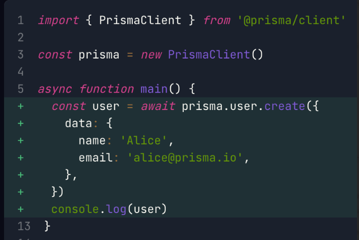

# Object Relational Mapping

# 
## What

Object-Relational Mapping (ORM) is a programming technique used to convert data between incompatible type systems. It is a technique used in creating a bridge between object-oriented programs and databases.In simpler terms, it’s a way to manage database data using objects in programming languages. ORM allows developers to work with database data as if they were working with regular objects in their chosen language, without having to write complex SQL queries.

## Why

- **Simplicity**: ORM abstracts the database interactions, allowing developers to work with database data using the programming language they are comfortable with, rather than writing complex SQL queries.
- **Maintainability**: Changes to the database schema or the object model can be managed more easily, as they are often centralized in the ORM layer.
- **Productivity**: By automating the mapping between the database and the application, ORMs can significantly reduce the amount of boilerplate code developers need to write.
- **Performance Optimizations**: Many ORMs come with built-in optimizations like lazy loading, caching, and transaction management, which can enhance the performance of applications.
- **Database Abstraction**: ORMs abstract the database, so developers can switch underlying databases with minimal changes to the application code.

## How

 ORM creates a model of the object-oriented program with a high level of abstraction. ORM translates database structure and produces a structured map. The mapping describes the connections between objects and various tables. In response to updates the application makes to the data object, ORM uses this information to translate data between tables and create the SQL code for a relational database to insert, update, create, and delete data **(CRUD)**.ORM works by creating a “virtual object database” that can be used from within the programming language. There are several steps involved:

1. **Define Models**: Define classes in your programming language that represent tables in your database. Each class corresponds to a table, and instances of a class represent rows in the table.
2. **Mapping**: Map these classes to the database tables. This can be done using annotations in the code or separate mapping files.
3. **Perform Operations**: Perform CRUD (Create, Read, Update, Delete) operations on the objects, and the ORM will translate these operations to SQL queries and execute them in the database.
4. **Synchronization**: ORM synchronizes the state of the objects with the database. When you change the properties of an object, these changes are automatically persisted to the database.

## Analogy

Think of ORM like having a personal translator who speaks both your language and a foreign language fluently. In the world of programming, your language is the programming language you use (like Python, C#, or TypeScript), and the foreign language is SQL, which is used to communicate with databases.

## Example
Using the popular [ORM Prisma](https://www.prisma.io/docs/getting-started/quickstart-sqlite) as an example, look at how they create a new user record in the database:
									

Notice that you don't actually see any SQL. Prisma abstracts away the actual SQL operation so that the dev just has to worry about calling the `create()` function, and passing in the data.