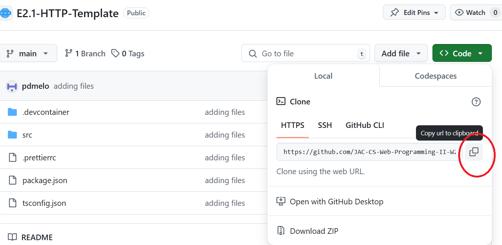
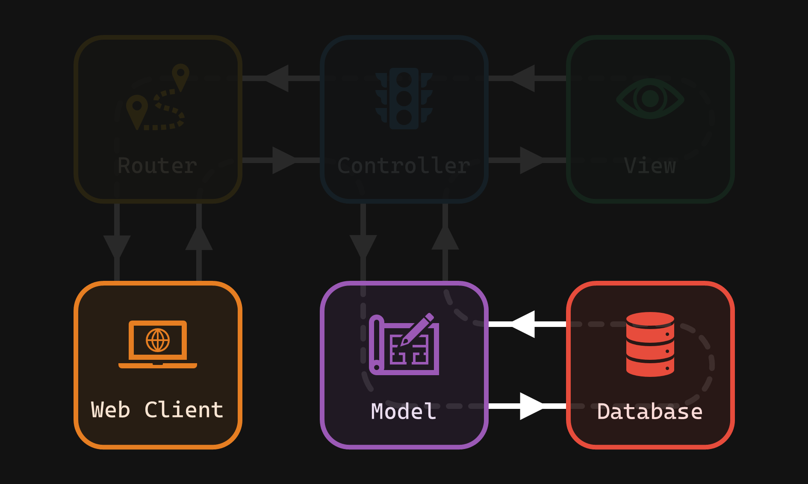
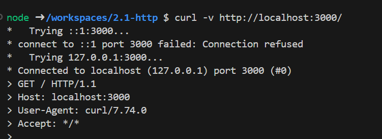

# 2.1 - HTTP Exercise

## 🎯 Objectives

1. **Define** the fundamental components and mechanics of the HTTP protocol (requests, responses, status codes, headers).
2. **Explain** the function of a web server and describe how Node.js’s `http` module enables its creation.
3. **Implement** a basic Node.js web server that handles different HTTP request methods (ex. GET, POST, PUT, DELETE).
4. **Parse** incoming HTTP requests to extract relevant information (URL, method, and data if applicable).
5. **Construct** appropriate HTTP responses, setting status codes, headers, and a JSON payload within the mini-server application.

## 🔨 Setup

1. Using the terminal, navigate to your `~/web-ii/exercises/` folder.

2. Go to [the repository for this exercise](https://github.com/JAC-CS-Web-Programming-II-W25/E2.1-HTTP-Template) and click `Code -> 📋` to copy the URL.

   

3. Clone the Git repo from the CLI `git clone <paste URL from GitHub>` (without the angle brackets) or using a GUI client like [GitHub Desktop](https://desktop.github.com/).

   - You may have to use the `HTTPS` or `SSH` URL to clone depending on your settings. If one doesn’t work, try the other by clicking `Use SSH` or `Use HTTPS` above the 📋, and copy the new URL.

4. Rename the cloned folder to `~/web-ii/exercises/2.1-http/`.

5. Start Docker Desktop.

6. In VS Code, hit `CMD/CTRL + SHIFT + P` and search + run `dev container: open folder in container`.

7. In the terminal of VS Code, hit the `+` icon to open a new terminal instance. Run `ls` to make sure you’re in the root directory of the exercise and that you see `package.json`.

8. Run `npm install` to install all our dependencies.

## 🔍 Context

Earlier this week we played the [HTTP Card Game](https://docs.google.com/presentation/d/1gYP2idYRLvMbEN4htfPwWssMf1nKX53qmY_f4crH8Pg/edit?usp=sharing) to learn the basic aspects of HTTP. To review, please read [this chapter](Notes/Week4/http) in the notes before continuing as it will teach you the terminology and concepts you need to know for this exercise.




## 🚦 Let’s Go

### Part 1: Building the Foundation

1. **Start Your Server Engine**

   - Open your `server.ts` file and paste the following code to set up a basic Node.js web server with TypeScript types:

     server.ts

   ```ts
   import http, { IncomingMessage, ServerResponse } from "http"; // The core Node module we're using to build our server.
   
   const hostname = "127.0.0.1"; // or 'localhost'
   const port = 3000;
   
   const server = http.createServer(  (req: IncomingMessage, res: ServerResponse) => {    // Request handling will come later!  
    }
                                   );
   server.listen(port, hostname, () => { 
       console.log(`Server running at http://${hostname}:${port}/`);
   });
   ```
   
   - Start the server by running `npm run server`.

### Part 2: Processing Requests

1. Open a **separate terminal window**. We’ll use this one to make cURL requests and see the server responses.

2. **The GET Test**

   - In your cURL terminal, type: `curl -v http://localhost:3000/`
   - Examine the output; you’ll see *HTTP* headers and other details of the request/response exchange. *We haven’t set up response content yet, so don’t be surprised if the process hangs!*

   

   - Hit CTRL + C to exit the process.

3. **Let’s Build an Actual Response**

   - Back in `server.ts`, inside the `createServer` callback, let’s handle GET requests to the root path (’/’):

   server.ts

   ```ts
   // Inside createServer(...)
   
   if (req.method === "GET" && req.url === "/") {
   
     res.statusCode = 200;
   
     res.setHeader("Content-Type", "application/json");
   
     res.end(
   
       JSON.stringify(
   
         { message: "Hello from the Pokemon Server!" },
   
         null,
   
         2
   
       )
   
     );
   
   }
   ```
   - **Save the file** to apply the changes. The server should automatically restart in the terminal.
   
   - Run the GET cURL command again (`curl -v http://localhost:3000/`); you should see our JSON response!
   
     (Psst..you can view this on your browser too http://localhost:3000/ 😊)

### Part 3: Expanding our Pokemon API

1. **Data Setup**

   - Add the Pokemon interface and sample data at the top of `server.ts`:

   ```ts
   interface Pokemon {  
       id: number;  
       name: string;  
       type: string;
   }
   const database: Pokemon[] = [  
       // Add one Pokemon object here with ID 1.
   ];
   ```

2. **GET All Pokemon**

   - Enhance the `GET /` route:

   ```ts
   if (req.method === "GET" && req.url === "/") {
   
     // ... (Existing code remains the same)
   
   } else if (req.method === "GET" && req.url === "/pokemon") {
   
     res.statusCode = 200;
   
     res.setHeader("Content-Type", "application/json");
   
     res.end(
   
       JSON.stringify(
   
         { message: "All Pokemon", payload: database },
   
         null,
   
         2
   
       )
   
     );
   
   }
   ```

   - Try it! `curl -v http://localhost:3000/pokemon`
   - You should see an array of one Pokemon.

3. **GET One Pokemon**

   server.ts

   ```ts
   // ... Inside createServer (...)
   else if (req.method === 'GET' && req.url?.startsWith('/pokemon/')) {    
       // Find Pokemon by ID    
       const urlParts = req.url.split('/');    
       const pokemonId = parseInt(urlParts[2]);
       
       const foundPokemon = database.find(pokemon => pokemon.id === pokemonId);
       
       if (foundPokemon) {
           res.statusCode = 200;        
           res.setHeader('Content-Type', 'application/json');        
           res.end(JSON.stringify({ message: 'Pokemon found', payload: foundPokemon }, null, 2));    
       } else {        
               res.statusCode = 404;        
               res.end(JSON.stringify({ message: 'Pokemon not found' }, null, 2));
           }
   } else if (req.method === 'GET' && req.url === '/pokemon') {   
       // Existing: Get all Pokemon ...
   }
   ```

   - Try it!

   Terminal window

   ```
   curl -v http://localhost:3000/pokemon/1  // Replace '1' with the Pokemon's ID
   ```

   1. **URL Matching:** We now check if the URL starts with `/pokemon/`. If so, we assume the user is requesting a specific Pokemon.
   2. **ID Extraction:** We split the URL and get the ID.
   3. **Finding the Pokemon:** The `find` method on the `pokemon` array locates the Pokemon with the matching ID.
   4. **Success/Error Response:** We send either the Pokemon details or a ‘404 Not Found’ error.

4. **POST a New Pokemon**

   - Let’s enable creating new Pokemon entries using a POST request to `/pokemon`. We’ll assume the client is sending JSON data representing a Pokemon.

   server.ts

   ```ts
   // ... Inside createServer(...)
   else if (req.method === 'POST' && req.url === '/pokemon') {    
       let body = ''; // To store incoming data    
       req.on('data', (chunk) => {        
           body += chunk.toString();    
       });
       
       req.on('end', () => {        
           const newPokemon = JSON.parse(body);
           // Add basic data logic (you'd likely use a database in a real application)        
           newPokemon.id = database.length + 1; // Simple ID assignment         
           database.push(newPokemon);
           res.statusCode = 201; // 'Created'        
           res.setHeader('Content-Type', 'application/json');        
           res.end(JSON.stringify({ message: 'Pokemon created!', payload: newPokemon }, null, 2));    
       });
   }
   ```
   
   - In your cURL terminal, send a POST request:
   
   Terminal window
   
   ```
   curl -v -X POST -H "Content-Type: application/json" \
   
        -d '{"name": "Pikachu", "type": "Electric"}' \
   
        http://localhost:3000/pokemon
   ```
   
   - You should see your success response! Check your `GET /pokemon` to see if the new addition is there.

> [!IMPORTANT]
>
> Important Considerations
> - **Error Handling:** A production server would include checks for bad data format, invalid input, etc.
> - **Data Persistence:** Currently, new Pokemon are only held in memory. Restarting the server wipes them out. A real app would use a database!

### Part 4: Updating Pokemon (PUT)

Now, it’s time to let trainers modify their Pokemon! Your task is to implement a PUT endpoint at `/pokemon/:id`.

- **Method:** This will be a ‘PUT’ request.
- **URL with ID:** The endpoint needs to include a way to capture the ‘id’ of the Pokemon to update (think about URL patterns).
- **Parsing Data:** PUT requests likely bring JSON data, similar to POST.
- **Finding and Modifying:** You’ll need logic to locate the correct Pokemon (by id) and replace its data.
- **Error Handling:** Don’t forget the “Pokemon not found” case!

### Part 5: Removing Pokemon (DELETE)

Let’s allow trainers to say goodbye to their Pokemon. Create a DELETE endpoint at `/pokemon/:id`.

- **Method:** Use the ‘DELETE’ HTTP method.
- **ID Matters:** You’ll again need to extract the Pokemon’s ‘id’ from the URL.
- **Splicing:** Review array modification methods in JavaScript to figure out how to remove a Pokemon.
- **Success/Error:** Send appropriate responses like in GET and PUT.

**Testing:**

Don’t forget to use cURL to test your new endpoints. Check the `GET /pokemon` afterwards to verify your changes worked.

## 📥 Submission

Perform the following cURL operations without the `-v` flag:

1. `POST` a new `/pokemon`.
2. `GET` the `/pokemon/2` that was inserted.
3. `UPDATE` the `/pokemon/2` to have a different name.
4. `GET` all the `/pokemon` to verify the name was changed.
5. `DELETE` the `/pokemon/2`.

Take a screenshot of the output so that I can see **all 5 statements were run successfully**. Submit the screenshot you took to the Moodle dropbox for this exercise.