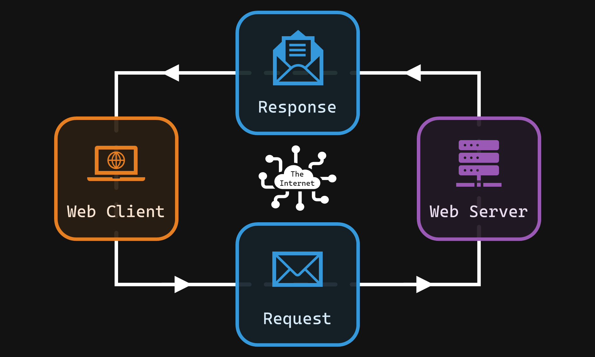
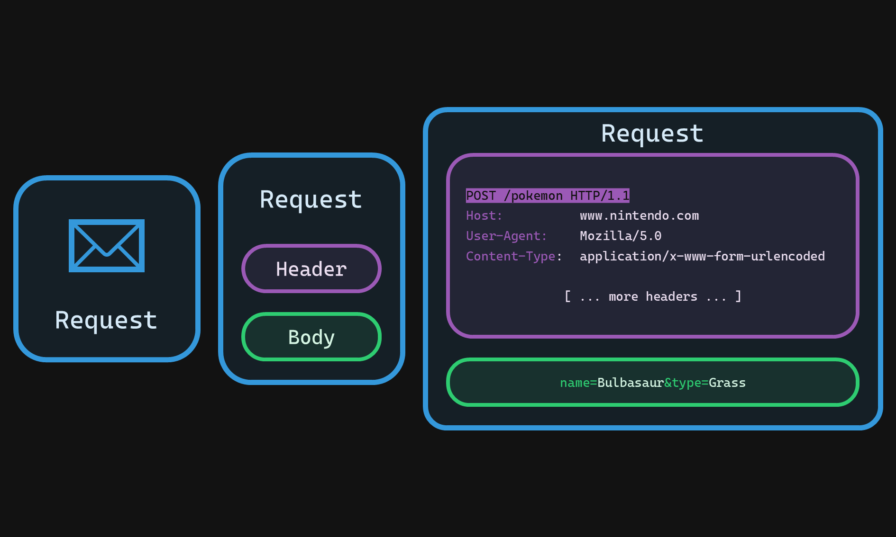
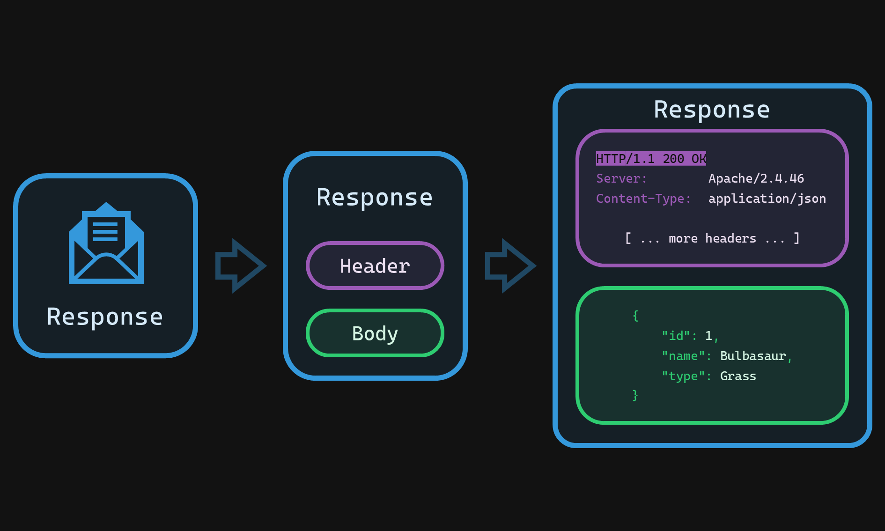

# HTTP

HTTP (Hypertext Transfer Protocol) is the language web browsers and servers use to communicate and exchange data like web pages, images, and videos.

[](https://www.youtube.com/watch?v=DrI2lUXL1no "http request and response")


A fundamental principle of the web is the *request-response cycle*. Web clients (ex. browsers, **but it doesn’t necessarily have to be a browser!**) make *requests* for resources from *web servers*. When the server receives a request, it executes code to fulfil the request and creates a *response*. This response is sent back to the client. If the client is, for example, a web browser, then it will render the response HTML code into a nice pretty webpage. If the client is, for example, a command line program, then it will print out the response directly in the terminal itself. Let’s take a closer look at the HTTP request ✉️ and HTTP response 💌 pieces!



## ✉️ HTTP Request

All activity that takes place on the web starts with a request. We must ask for something before we can receive it, after all. A HTTP request is simply a **chunk of text** that is specially formatted so that the web server can read it to understand what the client wants.



An HTTP request is composed of two parts: the **header** and the **body**. A helpful analogy for a request is to think of an empty envelope. The envelope will have the address of the person you are sending it to, as well as a return address, so that the person at the other end knows where to send the envelope back. In the context of the web, these are the *hostnames* or *IP addresses*.

### Request Header

The envelope has other helpful information written on it, such as:

- The request method:
  - `GET`: Read data
  - `POST`: Create data
  - `PUT`: Update data
  - `DELETE`: Destroy data
  - [And many more which you can read about here, if you’re curious](https://developer.mozilla.org/en-US/docs/Web/HTTP/Methods)!
- The path to the resource. In this case, it’s `/pokemon`. This can also be referred to as an *endpoint*.
- The version of HTTP that we’re going to use. In this case, we’re using `HTTP/1.1`.
- The location we want to send the request to. In this case, `www.nintendo.com`.
- The client that made the request (ex. web browser vs command line tool, etc.)
- The type of data contained in the request body
- [And many more which you can read about here, if you’re curious](https://developer.mozilla.org/en-US/docs/Web/HTTP/Headers)!

### Request Body

The envelope will also (optionally) have data that the server will need to process the particular request. The format of this data can be *XML*, *JSON*, *HTML form data*, etc. Whatever the format is, the request header needs to state the format type so that the server knows how to read the data correctly.

The format of the data being sent in the above diagram is *HTML form data*, or, `x-www-form-urlencoded`.

> [!NOTE]
>
> To summarize the above diagram
> 1. We’re making a `POST` request, meaning we want to create something;
> 2. We want to hit the `/pokemon` endpoint. Since we’re making a `POST` request, this means that we want to create a new Pokémon;
> 3. The place we want to send the request to is `www.nintendo.com`;
> 4. The information of the new Pokémon we want to create can be found in the body of the request in the *HTML form data* format.

## 💌 HTTP Response

Once the server receives the request, it will start to execute code (JavaScript in our case) that will build the *HTTP response*. The response looks much like the request in that they both have a **header** and a **body**.



### Response Header

The header of the response contains much of the same type of information as the request. The two that we’ll highlight here are the *status code* and *content type*.

#### HTTP Status Code

The status code is one of the first pieces of information the client will look for when it receives a response from the server. Each code has a special meaning that tells the client how the request was handled by the server. Here are the common ones:

- ✅ `200 OK`: Everything went well! 😊
- 📝 `201 Created`: The resource was successfully created! 😊
- ❌ `400 Bad Request`: Something about the request was invalid.
- 🙅‍♀️ `403 Forbidden`: You requested a resource which you’re not allowed to access.
- 🤷‍♂️ `404 Not Found`: The resource your requested doesn’t exist.
- 💥 `500 Internal Server Error`: Something went wrong when processing your request.
- 🚧 `503 ­Service Unavailable`: The server is down.
- [And many more which you can read about here, if you’re curious](https://developer.mozilla.org/en-US/docs/Web/HTTP/Status)!

#### Content Type

The content type tells the client what format of data the server has responded with. Common ones include:

- `text/html`: When sending a webpage.
- `text/css`: When sending a style sheet.
- `image/jpeg`: When sending a JPEG image.
- `application/x-www-form-urlencoded`: When sending a submitted form to the server.
- `application/json`: When exchanging data with a REST API.
- [And many more which you can read about here, if you’re curious](https://www.iana.org/assignments/media-types/media-types.xhtml)!

### Response Body

The contents of the response body depends on what request method was initially made:

- If the request was a `GET`: The response will be the retrieved data.
- If the request was a `POST`: The response will be the entity that was created.
- If the request was a `PUT`: The response will be the entity that was edited.
- If the request was a `DELETE`: The response will be the entity that was deleted.

The format of the data in the body will depend on the `Content-Type` stated in the response header. In the above diagram, the `Content-Type` is *JSON*.

## ❓ Query Parameters

- Query parameters are extra pieces of information appended to the end of a URL.
- They are presented as key-value pairs separated by an equals sign (=) and multiple pairs are joined by ampersands (&).
- They begin after a question mark (?) in the URL.

**Why are query parameters used?**

- **Filtering and sorting data:** To narrow down results on a website (e.g., an e-commerce site allowing you to filter products by color, size, or price range).
- **Specifying content:** To direct the server to return a specific version of a resource (e.g., language translation, different file formats).
- **Tracking:** To identify the source of traffic in web analytics (e.g., campaign tags, ad identifiers).

**How are query parameters structured?**

```
https://www.example.com/search?category=electronics&price_max=500&sort=newest
```

In this example:

- **Base URL:** https://www.example.com/search
- Query parameters:
  - `category=electronics`
  - `price_max=500`
  - `sort=newest`

**When should query parameters be used?**

- When you need to send data to the server that shouldn’t be a permanent part of the URL path.
- When the data being sent can be publicly visible without privacy or security concerns (unlike data sent in the body of a POST request).