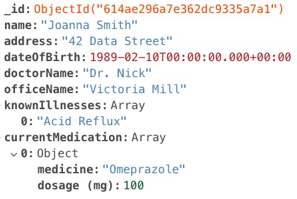

#  🍃MongoDB

## What is MongoDB?

A NoSQL database designed for high performance and scalability
Uses a document-based model instead of tables and rows
Stores data in JSON-like BSON format
📌 Key Features
✅ Flexible Schema – No fixed structure, making it adaptable
✅ Scalability – Supports horizontal scaling with sharding
✅ High Performance – Optimized for fast reads and writes
✅ Rich Query Language – Supports filtering, aggregation, indexing

📌 MongoDB Atlas – Cloud-Based Solution

- MongoDB Atlas is an online Database-as-a-Service (DBaaS)

- Enables companies to deploy into the cloud quickly and efficiently

📌 MongoDB in Full-Stack Development

- Works seamlessly with:

  - Back-end: Open-source frameworks like Node.js & Express.js
  - Front-end: Open-source frameworks like React

- Provides a cost-effective full-stack solution for businesses and students to develop new applications quickly and efficiently

📌 Why Use MongoDB?

Ideal for big data, real-time analytics, and content management
Handles large volumes of unstructured or semi-structured data
Popular in modern web apps, IoT, and AI/ML applications

🛠 Use Cases: E-commerce, Social Media, Real-time Analytics

## 🆚NoSQL vs SQL

### 🗃️ SQL
- A **SQL ** database, like MySQL, is a **relational** database. This means that data is stored in in a structured format, usually called **tables**, containing specific pieces and types of data. Relationships are explicitly made between these tables. That is why you have foreign keys, joins, etc. along with the idea of one-to-one, one-to-many, many-to-one and many-to-many relationships.
  - A SQL database works best when the data they contain doesn't change very often, and when accuracy is crucial.

###  📄NoSQL
- By contrast, a **NoSQL** database is **non-relational**. Data is stored in "unstructured", non-tabular form. For instance, they might be stored in data structures called **documents**. A document can be highly detailed while containing a range of different types of information in different formats. This lets various types of information be organized side-by-side

  - A NoSQL database is often used when large quantities of complex and diverse data need to be organized, and/or when data changes frequently. They are also useful for developing applications where the data needs change quickly.
  - Unstructured data = not arranged according to a pre-set model or schema.
  - In many cases, a NoSQL document is specified in terms of name-value pairs and can be represented using JSON format.

  example:

  

Click here to read more on the [Database](https://www.mongodb.com/databases/non-relational)

- In NoSQL, each "piece" of data is stored in a single **document**. 
  - This may have multiple fields of information,

  - A document roughly corresponds to a row of information in a SQL database

  - The fields roughly correspond to the columns in a SQL database

- Multiple documents with the same type can be put together in a **collection**
  - This can roughly be thought of as corresponding to a table in MySQL.

- A non-relational database can be massive and can grow exponentially in principle. Since new data in different formats can be added at any time, it is highly flexible to use.

- 80 to 90% of data generated and collected by organizations is unstructured, and its volumes are growing rapidly.

MongoDB - [Unstructured-data](https://www.mongodb.com/unstructured-data)

##  ⚙️MongoDB Operations
MongoDb offers a variety of queries that support CRUD operations.  These are similar in capability to MySQL operations, but the details/syntax are quite different.
https://www.mongodb.com/docs/drivers/node/current/usage-examples 
https://mongodb.github.io/node-mongodb-native/4.13/classes/Collection.html

### Common operations include:

**Create:**
collection.insertOne()
collection.insertMany()

**Read**
collection.findOne()
collection.find()

**Update**
collection.updateOne()
collection.updateMany()
collection.replaceOne()

**Update**
collection.deleteOne()
collection.deleteMany()

**Additional operations include:**
collection.findById()
collection.findByIdAndDelete()
collection.findByIdAndRemove()
collection.findByIdAndUpdate()
collection.findOneAndDelete()
collection.findOneAndRemove()
collection.findOneAndReplace()
collection.findOneAndUpdate()
collection.countDocuments()

🔍**More advanced:**
- 	Sort
- 	Join

## MongoDB and TypeScript

https://www.mongodb.com/resources/products/compatibilities/using-typescript-with-mongodb-tutorial

## 📚 Resources

- https://www.w3schools.com/nodejs/nodejs_mongodb.asp 

- https://www.npmjs.com/package/mongodb 

- https://mongodb.github.io/node-mongodb-native 
