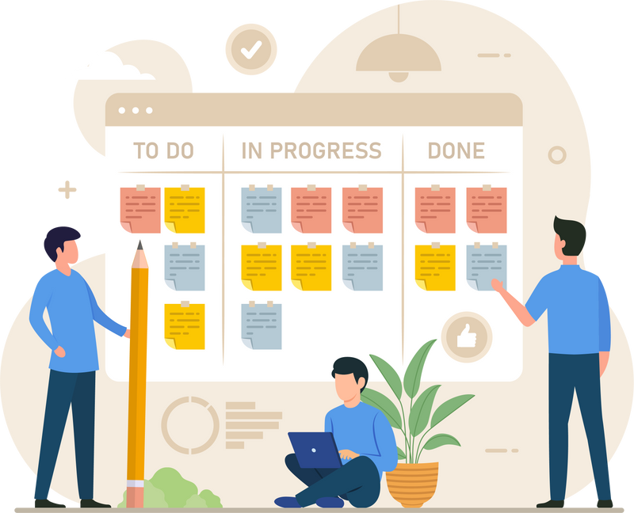
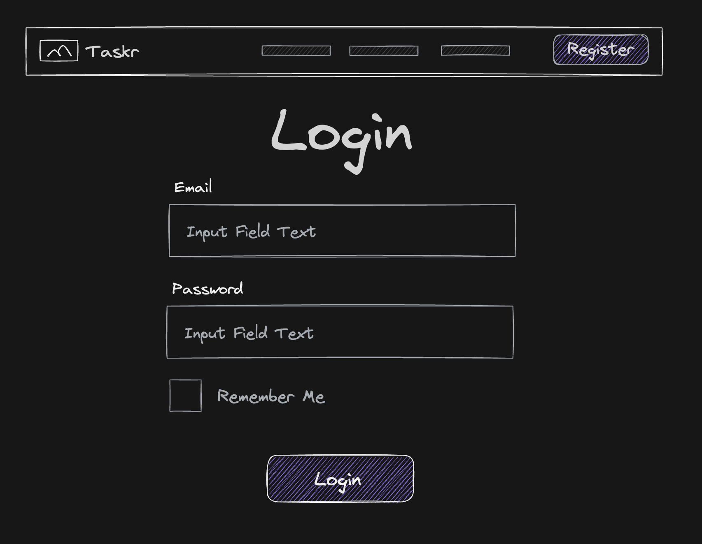
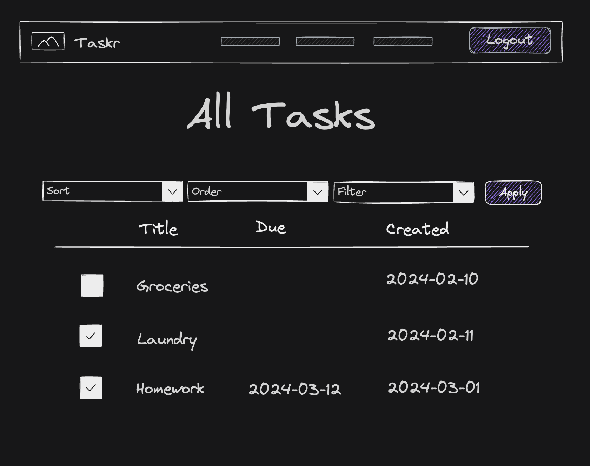
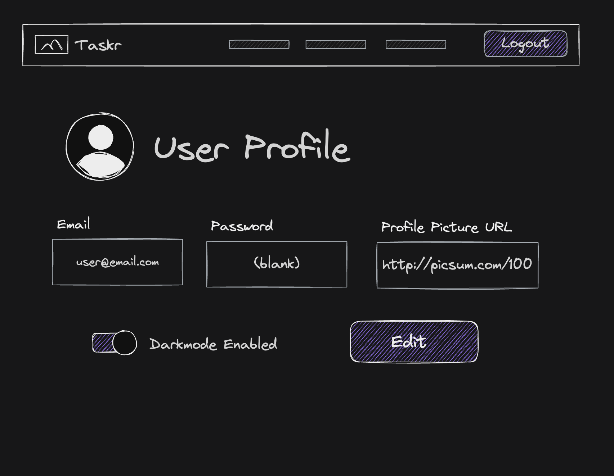

# Example Proposal
---

Introducing "Taskr" – a collaborative task management platform where teams, families, or study groups can manage shared projects and hold each other accountable. This app is for:

-   Small teams and project groups needing a lightweight way to coordinate tasks.
-   Households or roommates looking to organize shared chores and responsibilities.
-   Students working on group assignments.

Many existing task managers are overly complex for small-scale collaboration or lack features to foster a sense of shared ownership. Taskr aims to bridge the gap, providing the right balance of structure and simplicity for coordination.

## 🧱 Core Functionality

-   **Project Creation:** Users can create new shared projects with a title and basic description.
-   **User Management:** Users can join existing projects using a unique project code.
-   **Task Management:** Within a project, users can:
    -   Create new tasks with descriptions and due dates.
    -   Assign tasks to specific project members.
    -   Mark tasks as completed.
-   **Basic Notifications:** Users receive notifications when assigned a task or when a task they're involved in is marked complete.
-   **In-Task Chat:** Simple comment threads attached to tasks for focused discussions.
-   **Custom Task Statuses:** Ability to define statuses beyond "Not Started" and "Completed" (e.g., "In Progress", "Blocked")

### Requirements

#### Task Stories

-   As a user, I want to create a task so that I can keep track of what I have to get done.
-   As a user, I want to view my tasks in a list so I can see what needs my attention.
-   As a user, I want to edit a task to update its details or due date.
-   As a user, I want to mark a task as complete so I can track my progress.
-   As a user, I want to delete a task when it's no longer relevant.

#### Project Stories

-   As a user, I want to create a new project so I can organize a set of related tasks.
-   As a user, I want to join a project using an invite code so I can collaborate with others.
-   As a user, I want to view all projects I'm part of to easily switch between them.

#### User Management Stories

-   As a user, I want to register for an account so I can start using the app.
-   As a user, I want to log in to my account to access my tasks and projects.
-   As a user, I want to log out of my account to securely end my session.

#### Comment Stories

-   As a user, I want to leave a comment on a task to ask for clarification or provide an update.
-   As a user, I want to see comments from other team members on a task to stay on the same page.
-   As a user, I want to be notified if there's a new comment on a task I'm involved with.

#### Status Stories

-   As a user, I want to mark a task as "In Progress" to signal that I'm actively working on it.
-   As a user, I want to mark a task as "Blocked" to indicate that I can't proceed due to a dependency.
-   As a user, I want to view tasks grouped by their status to get a quick overview of the project's health.

## ᛦ Entity Relationships

>[!note]
On Github, open the `erd.mermaid` file in your project repo to view the source code for the following diagram. You can copy the code into the [live Mermaid editor](https://mermaid.live) to play around and make changes specific to your app.

-   **Authentication System:** Handling user registration, login, logout, and session management.
-   **Project Management:** Logic for project creation, joining projects, and CRUD operations on projects.
-   **Task Management:** Logic for task creation, assignment, updates, filtering, and notifications.
-   **UI Elements:** Design of forms, task lists, project overview, notification lists.

## 📍 API Routes

>[!note]
>These are only a few routes to give you an idea, these would definitely not be all the routes for this kind of app!

### Project Management

| Request              | Action                           | Response              | Description                                                  |
| -------------------- | -------------------------------- | --------------------- | ------------------------------------------------------------ |
| POST /projects       | ProjectController::createProject | 201 /projects/:id     | Create a new project and redirect to the project's view      |
| GET /projects/:id    | ProjectController::getProject    | 200 ProjectDetailView | Retrieve details of a specific project                       |
| PUT /projects/:id    | ProjectController::updateProject | 200 ProjectDetailView | Update an existing project's information                     |
| PUT /projects/:id    | ProjectController::updateProject | 403 /projects/:id     | Forbidden if trying to edit a project the user did not create. |
| DELETE /projects/:id | ProjectController::deleteProject | 204 /projects         | Delete a project (consider implications – should tasks be deleted too?) |

### Task Management

| Request                                   | Action                     | Response                       | Description                                                  |
| ----------------------------------------- | -------------------------- | ------------------------------ | ------------------------------------------------------------ |
| POST /projects/:projectId/tasks           | TaskController::createTask | 201 /projects/:projectId       | Create a new task within a project                           |
| GET /projects/:projectId/tasks/:taskId    | TaskController::getTask    | 200 TaskDetailView             | Retrieve a specific task's details                           |
| GET /projects/:projectId/tasks/:taskId    | TaskController::getTask    | 404 ErrorView                  | Display an error if trying to access a project task that does not exist. |
| PUT /projects/:projectId/tasks/:taskId    | TaskController::updateTask | 200 TaskDetailView             | Edit an existing task                                        |
| DELETE /projects/:projectId/tasks/:taskId | TaskController::deleteTask | 204 /projects/:projectId/tasks | Delete a task                                                |

## 📐 Wireframes

>[!note]
>Don't go crazy detailed with the wireframes! These should be minimal sketches to convey to the customer what the app will roughly look like. These things tend to change over time as requirements evolve, but you need to start from somewhere.

The login view is the initial screen where users can enter their credentials to log into their account. It typically consists of a form with input fields for the username/email and password, along with a "Login" button. The login view should also include a link to the registration page for new users who don't have an account yet.

All the tasks for the logged in user where they can sort by title, due date, and created date. They can also filter tasks to only see completed or uncompleted tasks. The user can check off tasks here, or if they want a more detailed view, can click on one of the tasks (see next view).

This view shows the user more details for one specific task. If a due date was set, it will tell them how many days from now the task is due. There is a description field to provide more context for the task, as well as task actions to mark the task as complete, edit the task, or delete. On the right we have a sub-task list so that the user can breakdown the task steps even further. The sub-tasks can be checked off when completed.

The user profile shows the user's profile picture if set, and gives them a place where they can update their email and password. Here is also where they can control if the site is displayed in light or dark mode depending on the value of the toggle switch./