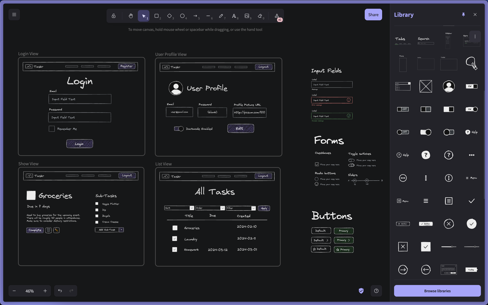

# Specifications
---

-   💯 **Worth**:
    -   **Proposal**: 7%
    -   **Implementation**: 25%
-   📅 **Due**:
    -   **Proposal**: April 25/26, 2025 @ 11:30
    -   **Implementation**: TBD @ your demo appointment time

## 🎯 Objectives

-   **Apply** best practices in database design to model real-world entities and their relationships.
-   **Create** controllers to handle HTTP requests, facilitate interactions with models, and generate appropriate responses.
-   **Design** user-friendly views with Handlebars, integrating dynamic content to enhance the user experience.
-   **Implement** a robust authentication system using sessions and cookies to manage user login, logout, and route authorization.
-   **Analyze** potential errors and implement graceful error handling mechanisms to provide meaningful feedback to the user.
-   **Construct** unit tests for models, HTTP tests for controllers, and end-to-end tests (using Playwright) to ensure code reliability and maintainability.
-   **Evaluate** the overall effectiveness of the implemented project in alignment with the initial design proposal.

## 🔍 Context

This is it - the culmination of all the skills and knowledge about web development over this past semester. Your task is simple: **create a web application using the MVC architecture we've built up over last 3 months**.

This project can be done, at most, in pairs.  I highly recommend working with someone for this project! If you are having trouble finding a partner, let me know, and I can help pair you up with someone.

The project scope should scale with the number of people. In other words, I expect a bigger app with more features from pairs than from individuals. I will try to ensure this as best as possible based on your proposal.

>[!tip]
>What kind of app? It could be any sort of interactive web app. Think social media (Instagram, Twitter, Reddit, etc.), e-commerce (Amazon or literally any store where you buy things), management apps (personal budget, book tracker, movie tracker), services (Uber Eats, AirBnB), media (Netflix, YouTube), [the sky is the limit](https://decode.agency/article/best-web-app-ideas/)!


## 📐 Proposal

I ask that you go about your design and architecture in a meaningful and purpose-driven way. For this reason, I'm asking you to first write a proposal for your web app. This will make you think about the different models, controllers, views, routes, etc. that you will have to adhere to when it comes time for the implementation.

>[!warning]
>While the due date for the proposal is **April 25/26**, the faster you submit, the more time you'll have to work on your implementation. I must look over your proposal and confirm that you're planning to meet all the criteria for the implementation phase. If there are things you're missing or need to fix, I will let you know so that you can incorporate my feedback. I can then give you the green light to get started.


The proposal document should be the `README.md` for your repo. **Please look at the [Sample Proposal](/project/example-proposal)** to get an idea of how your proposal should look. If you're not familiar with writing markdown (`.md`) then please do this [short tutorial](https://www.markdowntutorial.com/). You can also look at how the `README.md` file for this repo was written.

The proposal must include the following sections:

1. **Description:** Give a high level overview of the app. This should include who the app is made for, what problems it solves, and why someone would want to use it. In other words, what value does it provide?
2. **Requirements:** What the user should be able to do in your web app. This means writing [user stories](https://www.visual-paradigm.com/guide/agile-software-development/what-is-user-story/) for the different functions of your app.
3. **Entity Relationships:**
    - You should already be familiar with ERDs from your database class.
    - If you're curious as to how the one in the sample proposal is done,  [Mermaid](https://mermaid.js.org) was used to write out the diagrams in plaintext which get automatically rendered. This allows the diagrams to be version controlled using Git! Check out the docs [here](https://mermaid.js.org/syntax/entityRelationshipDiagram.html) and live editor [here](https://mermaid.live).
    - If you'd rather use a GUI, [app.diagrams.net](https://app.diagrams.net/) and [Lucidchart](https://www.lucidchart.com/pages/) are good free tools.
4. **API Routes:**
    - Outline all the routes that a user of your app will be able to hit. From our Todo app, these were routes like GET `/todos` to get all the todos, or POST `/todos` to create a todo, for example.
    - The routes should be outlined in a table (see sample proposal) with the following headers:
        - **Request**: The method and URL of the route.
        - **Action**: The controller and method the route will hit.
        - **Response**: The status code and view (if rendering a template) or path (if redirecting).
        - **Description**: A short explanation of what the result should be after hitting this route.
5. **Wireframes:**
    - These are _rough_ (big emphasis on rough) drawings to give yourself an idea of what the web app will look like and to give me a preview of what to expect.
    - These can be hand drawn (paper or tablet) or digitally drawn using tools like MSPaint, Photoshop - whatever is easiest for you! If you go hand drawn then please scan in photos of your drawings to include in the proposal document.
    - You don't have to provide a wireframe for each and every view/state of your app. Only the major ones that provide the most functionality.
    - The wireframes in the sample proposal were made using [Excalidraw](https://excalidraw.com/). [Here's a nice short tutorial](https://www.youtube.com/watch?v=O1Kqxw07VWM) .




## 📃 Requirements

For the final implementation, here's what I'll be looking for:

| Criteria                              | Excellent                                                                                                                                                                                          | Good                                                                                                                                           | Needs Improvement                                                                                                               | Insufficient                                                                                                          |
| ------------------------------------- | -------------------------------------------------------------------------------------------------------------------------------------------------------------------------------------------------- | ---------------------------------------------------------------------------------------------------------------------------------------------- | ------------------------------------------------------------------------------------------------------------------------------- | --------------------------------------------------------------------------------------------------------------------- |
| 🫥 **Models**                          | Data models are well-designed, reflecting the relationships between entities with appropriate normalization. Queries are optimized and efficient by using joins.                                   | Data models are mostly logical, but there might be room for minor optimizations or clarity in relationships. Queries work correctly.           | Data models have fundamental flaws in structure, or there's excessive redundancy. Inefficient queries might impact performance. | Data models are significantly incomplete or poorly structured, hindering functionality. Queries are absent or broken. |
| 🚥 **Controllers**                    | Controllers are well-structured, effectively handling API routes and interactions with models. Proper authorization logic is implemented to protect sensitive actions. Input validation is robust. | Controller logic is functional, with most routes implemented. Authorization is mostly in place. Input validation has some coverage.            | Controllers have inconsistent organization or significant gaps in routes. Limited authorization and input validation.           | Controllers are largely missing, or logic is severely flawed, compromising core functionality.                        |
| 👀 **Views**                          | React components are well-organized, and dynamic content is integrated seamlessly. The UI is responsive and visually appealing. Thought was clearly put into the design and user experience. | Components are functional and data is rendered correctly. UI has a basic usable structure, while not necessarily responsive.           | Components have errors in data display or lack essential dynamic elements. UI is difficult to navigate or has layout issues. | Components are incomplete or broken, preventing core functionality. UI is unusable.                           |
| 🔐 **Authentication & Authorization** | Robust implementation of session management and cookies. Login/logout flows work seamlessly. Routes are appropriately protected based on user authentication status.                               | Authentication system is functional with session management and cookies. Most essential routes are protected, but some oversights might exist. | Authentication has inconsistencies; sessions or cookies may have errors. Route protection is incomplete or has logical flaws.   | Authentication is largely non-functional. Limited or no use of cookies and sessions. Routes lack protection.          |
| ⚠️ **Error Handling**                 | Errors are handled gracefully, with clear messages to the user. Appropriate HTTP status codes are used on the server side.                                                                         | Errors are generally handled, but some scenarios might lack user-friendly feedback. Status codes are mostly correct.                           | Limited error handling; confusing messages or unexpected behavior for the user. Inconsistent use of status codes.               | Minimal or almost no error handling, leading to application crashes and a poor user experience.                       |
| ✅ **Testing**                        | Comprehensive test suite with: Unit tests covering model logic. HTTP tests for controller routes (both success and error scenarios). End-to-end tests (Playwright) automating critical user flows. | Good test coverage exists, but there might be gaps in unit tests, controller tests, or end-to-end scenarios.                                   | Some testing is present, but it covers only a limited portion of the application's logic or functionality.                      | Tests are largely absent, making it difficult to ensure code reliability.                                             |
| 🔬 **Adherence to Proposal**          | Project exceeds the proposed feature set or introduces well-justified, creative enhancements. At least the required number of entities are implemented and functional (3 for solo, 5 for pairs).   | Project mostly delivers on the proposed features. At least the required number of entities are implemented.                                    | Project lacks some of the core features outlined in the proposal. The minimum entity count may not be met.                      | Project significantly deviates from the proposal and lacks the majority of the planned functionality.                 |


## 🌱 Starter

I will provide a starter template (Working on it....)


### Using External APIs

If you need to query an external API from your server code, here's an example of how you can do so using the [Axios](https://www.npmjs.com/package/axios) NPM module. Run `npm install axios` and create a `fetch.ts` at the root of your project.

```typescript
// fetch.ts
import postgres from "postgres";
import axios from "axios";

const sql = postgres({
	database: "TodoDB", // Change
});

const main = async () => {
	const url = "https://pokeapi.co/api/v2/pokemon/pikachu"; // Change
	const response = await axios.get(url);

	console.log(response.data);

	try {
		await sql`
			INSERT INTO todos ("title", "description")
			VALUES (${response.data.name}, ${response.data.name})
		`;

		console.log("Successfully inserted! CTRL+C to exit.");
	} catch (error) {
		console.error(error);
	}
};

main();
```

This example fetches from the [PokeAPI](https://www.npmjs.com/package/axios#example) and inserts in the TodoDB we've been using so far in the course. If course, you will replace these with the database name and API that you're using.

You can use the `axios` module in any of your project files, this was just an example of how to set it up and run it standalone. You could, for example, `await axios.get(url)` in your controller if you need supplemental data from the API for your app.

## 📥 Submission

Once you've made your final `git push` to GitHub, here's what you have to do to submit:

1. Ensure that the `README.md` for your repo is the proposal document.
2. Notify me either in class or on Teams as soon as you push so that I can take a look and give you the green light to start implementation.
4. Schedule an demonstration appointment with me where I'll be grading your submission on the spot (online, on Teams) using a grading rubric.
    - Details for how to schedule the demo will be available closer to the deadline. **You don't have to wait until the official slots are available to demo**. If you're done earlier, let me know, and we'll find a time to demo so you can get this class off your plate and focus on the 42 other things you have to do for school!
